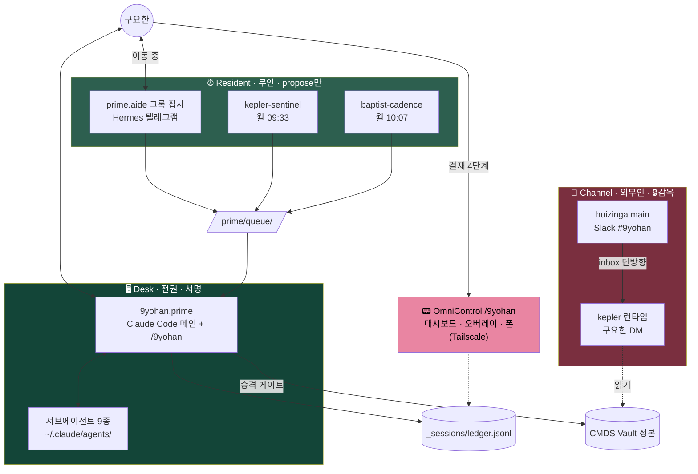

# 9요한 프로젝트 마스터 인덱스

9요한(구요한)을 메타 오케스트레이터로 두고, CMDS 900 Divisions (901~909)에 1:1 대응하는 9명의 "요한" 전문가 에이전트를 설계·구현·**가동**한 전체 프로젝트의 **단일 진입점**.

> "내가 여러 가지 일을 다 잘하고, 모든 부캐를 본캐처럼 탁월하게 사용한다" — 이 정체성을 시스템적으로 externalize 한 구조.
> 정본은 [[canonical]]. 라이브 사이트는 https://9yohan.cmdspace.work.

> [!success] 2026-08-24 · v4 — **설계 문서에서 운영 시스템으로**
> 이 README의 v3(7/01)까지는 "설계는 끝났고 런타임은 비어 있다"였다. 지금은 아니다. 9종 서브에이전트·라우터 스킬·Hermes 상주 2종·OpenClaw 채널 2종이 **돌고 있고**, 감옥·관제 대시보드·세션 원장이 붙었다. 이번 개정에서 [[9YOHAN-SECURITY]]·[[9YOHAN-CONTROL-PLANE]] 2개 정본을 신설하고 [[architecture]]·[[workflows]]·[[schemas]]를 현실에 맞췄다.

---

## 🤖 에이전트가 작업 시작 전 자동 로드 (@ import)

이 프로젝트 작업 시 LLM agent가 반드시 컨텍스트로 가져가야 할 핵심 파일들. 본 README는 entry point일 뿐.

@1. Identity/canonical.md
@1. Identity/personas/README.md
@2. Implementation/architecture.md
@2. Implementation/2026-08-23-mbp-constellation-implementation-plan.md
@3. Operations/9YOHAN-OPERATIONS.md

> 채널·보안 작업이면 [[9YOHAN-SECURITY]], 관제·결재·원장이면 [[9YOHAN-CONTROL-PLANE]], 협업 패턴이면 [[workflows]] · [[playbooks]] · [[schemas]]를 추가 로드. 에이전트 프롬프트 전문은 [[constellation]], 리서치 배경은 [[요한쓰]].

---

## ⚡ 현재 가동 상태 (2026-08-24)



| 컴포넌트 | 위치 | 라이브니스 확인 |
|---|---|---|
| 서브에이전트 9종 | `~/.claude/agents/{handle}.md` | 세션 시작 시 로드 |
| `/9yohan` 라우터 | `~/.claude/skills/9yohan/` | — |
| 그록 집사 (prime.aide) | `~/.hermes/SOUL.md` + 텔레그램 | `hermes cron list` (aide-heartbeat 09:03) |
| kepler-sentinel | Hermes cron 월 09:33 → 텔레그램 | cron Last run + **다이제스트 실물** |
| baptist-cadence | Hermes cron 월 10:07 | cadence heartbeat.log |
| huizinga (채널 봇) | OpenClaw `main` · Slack `#9yohan` | `openclaw gateway status` + **3-프로브** |
| kepler (채널 런타임) | OpenClaw `kepler` · 구요한 DM | `openclaw agents list` + 3-프로브 |
| 주간 계측 | `weekly-measure-all.sh` (일 21:23) | `9yohan-measure.jsonl` |
| 관제 대시보드 | OmniControl `/9yohan` | `curl /9yohan/data` |
| 결재 알림 | `yohan_propose` → 오버레이 카드 | `/hook/yohan` POST |

---

## 🗺 5-Location Map

9요한 산출물은 **5개의 물리적 위치**에 분산. 역할이 다르므로 분산 자체는 정상이고, **정본/미러 구분이 핵심**이다.

| Location | 경로 | 역할 |
|----------|------|------|
| **A. Orchestration folder** (이 폴더) | `70. Outputs/74. Projects/9yohan Constellation/` | **설계·운영 정본** |
| **B. Vault root — Division files** | [[📖 900 Divisions]] 하위 9 파일 | 각 Division의 CMDS 카테고리 페이지 |
| **C. Vault root — System files** | [[CLAUDE.md]] · [[AGENTS.md]] · [[CMDS.md]] · [[🏛 CMDS Head Quarter]] | LLM 컨텍스트 자동 로드 |
| **D. LLM Wiki reference layer** | `CMDS_LLM_Wiki/20. Wiki/22. Entities/9Yohan Constellation.md` | 외부 패턴과 연결하는 satellite |
| **E. DEV repo** | `~/DEV/9yohan-constellation/` | 공개 미러 + **운영 실행물** |
| **F. 런타임 파일** 🆕 | `~/.claude/agents/` · `~/.claude/skills/9yohan/` · `~/.claude/hooks/` · `~/.hermes/` · `~/.openclaw/` | 실제로 도는 것 |
| **G. 요한 스크래치** 🆕 | `00. Inbox/03. AI Agent/agents/{handle}/` | 요한별 메모리 · heartbeat · 세션 원장 |

> F·G는 v3까지 인덱싱되지 않았다. 시스템이 돌기 시작하면서 생긴 위치다.

---

## 📁 A. Orchestration Folder · 설계·운영 정본

### 🎯 1. Identity · 정체성

| 파일 | 역할 | 상태 |
|------|------|------|
| [[README]] | (이 파일) 마스터 인덱스 · 위치 맵 · 가동 상태 | 🔄 **v4 (2026-08-24)** |
| **[[canonical]]** | **정본 — 9 Divisions × 9 Johns × 9 Fruits 1:1:1 매핑의 단일 진실원천** | ✅ 확정 2026-04-19 |
| **[[personas/README]]** | 개별 페르소나 정본 인덱스 — 9 카드 + conductor | ✅ 2026-07-01 |

개별 카드: [[00-9yohan-prime]] (conductor) · [[901-kepler-map]] · [[902-goethe-sense]] · [[903-dewey-learn]] · [[904-bach-score]] · [[905-neumann-compute]] · [[906-baptist-prepare]] · [[907-mccarthy-reason]] · [[908-huizinga-play]] · [[909-calvin-advise]]

### ⚙ 2. Implementation · 구현

| 파일 | 역할 | 상태 |
|------|------|------|
| **[[architecture]]** | **하네스 기술 스펙 — 3-plane 토폴로지 · 런타임 바인딩 · 4계층 · 신뢰경계·관제면 위치** | 🔄 **전면 개정 2026-08-24** |
| [[constellation]] | 에이전트 운영 정의 · system prompt 전문 · 도구 · 핸드오프 | ✅ 정본 기반 |
| **[[2026-08-23-mbp-constellation-implementation-plan]]** | **배치 결정 (요한×런타임×모델) · D1~D7 · 3-Phase 체크리스트** | ✅ approved · Phase 1·2 완료 |
| [[2026-06-27-constellation-stack-design]] | 모델 가설 스택 설계 (위 문서가 그 "한 달 실측 후 결정"의 결정판) | 📦 보존 |

### 🔄 3. Operations · 실전 운영

| 파일 | 역할 | 상태 |
|------|------|------|
| **[[9YOHAN-OPERATIONS]]** | **운영 규약 — 불변식 · 라이브니스 · 승격 게이트 · Forget 전파 · 로테이션 감사 · 사람 결정 표면** | ✅ active |
| **[[9YOHAN-INCIDENTS]]** | **사고 원장 — 행 삭제 금지, 조치가 실물로 배포돼야 closed** | ✅ active (004까지 closed) |
| **[[9YOHAN-SECURITY]]** | **채널 평면 신뢰 경계 — 왜 설정으로 안 막히는가 · 감옥 명세 · 예외 2건의 근거 · 3-프로브** | 🆕 **2026-08-24** |
| **[[9YOHAN-CONTROL-PLANE]]** | **관제면·결재 루프·세션 원장 — 시간상수 분리 · 4단계 트랜잭션 · 레지스트리·타일 · Tailscale** | 🆕 **2026-08-24** |
| [[workflows]] | 5 primitive · Control Loop 11단계 · CMDS Stage 매핑 · 상태 전이 | 🔄 개정 2026-08-24 |
| [[playbooks]] | 실전 시나리오 10선 (mermaid sequence 포함) | ✅ |
| [[schemas]] | 메시지 규격 — **TaskPacket-8** · AgentResult(+self_docked) · SignedActionPacket | 🔄 개정 2026-08-24 |
| [[2026-06-27-kepler-map-wiki-freshness-sentinel]] | 901 첫 production 워크로드 기획 (→ Hermes cron 구현됨) | ✅ 배선 완료 |

### 🌐 Ecosystem · 생태계 플랜

| 파일 | 역할 | 상태 |
|------|------|------|
| [[ecosystem-plan]] | Claude Code · OpenClaw · Hermes 3-tool 분업 | ⚠️ **부분 폐기** — §5 Studio 런타임·§3 역할분담은 D1/D3/D5로 대체. 도구 프로필·판단 기준만 유효 |

### 📚 4. Research / 5. Audit

| 파일 | 역할 | 상태 |
|------|------|------|
| [[요한쓰]] | 선정 리서치 · 7개 외부 AI 어드바이저 제안 아카이브 | ✅ |
| [[audit-2026-05-11]] | 1차 종합 감사 (5-차원 팀 감사) | ✅ **Critical 3건 전부 해소 (8/24 후속 표기)** |

---

## 🚀 E. DEV Repo · 공개 미러 + 운영 실행물

- **GitHub**: https://github.com/johnfkoo951/9yohan-constellation
- **Live**: https://9yohan.cmdspace.work (Cloudflare DNS → Vercel · Proxy OFF)
- **Vercel project**: `9yohan-constellation` (scope `johnfkoo951s-projects`)

| 경로 | 내용 | 정본? | 공개 |
|---|---|---|---|
| `index.html` | 랜딩 (v4.3 landing 템플릿) | 실행물 | ✅ |
| `docs/index.html` | 상세 문서 뷰어 (editorial-docs · ⌘K) | 실행물 | ✅ |
| `docs/files/*.md` | **A 폴더 정본의 미러** | ❌ 미러 | ✅ |
| `ops/RUNBOOK.md` | 실행 절차 런북 | 미러 (정본 = SECURITY·CONTROL-PLANE) | ✅ |
| `ops/yohan-registry.json` | 요한 정체성 — 링 색·포컬 크롭 | **실행물 정본** | ✅ |
| `scripts/` | `yohan-log.sh` · `build-yohan-tiles.py` · `validate-persona-canon.py` · `build-og.sh` | 실행물 | ✅ |
| `assets/yohans/` | 초상 9종 + 미리 구운 타일(80/240px) | 실행물 | ✅ |
| `sessions/` | **심링크 → 볼트 `agents/_sessions/`** | 정본은 볼트 | ❌ gitignore |

> **A → E 미러 방향은 단방향이다.** 볼트를 고치고 레포로 복사한다. 반대로 하면 정본이 둘이 된다.

미러 후 검증:

```bash
cd ~/DEV/9yohan-constellation
python3 scripts/validate-persona-canon.py     # 페르소나 드리프트
python3 scripts/build-yohan-tiles.py --check  # 타일 최신 여부
```

---

## 📚 B. Vault Root · 9 Division 파일

| 파일 | 에이전트 | Handle | Fruit |
|------|---------|--------|-------|
| [[📚 901 Knowledge Management & Research Division]] | 케플러 요한 | `kepler.map` | 온유 |
| [[📚 902 Writing & Publishing Division]] | 괴테 요한 | `goethe.sense` | 사랑 |
| [[📚 903 Teaching & Curriculum Division]] | 듀이 요한 | `dewey.learn` | 자비 |
| [[📚 904 Creative Arts & Media Division]] | 바흐 요한 | `bach.score` | 희락 |
| [[📚 905 Research Methods & Analytics Division]] | 노이만 요한 | `neumann.compute` | 절제 |
| [[📚 906 Partnerships & Networks Division]] | 세례요한 | `baptist.prepare` | 오래 참음 |
| [[📚 907 Product & Engineering Division]] | 매카시 요한 | `mccarthy.reason` | 양선 |
| [[📚 908 Events & Community Engagement Division]] | 하위징아 요한 | `huizinga.play` | 화평 |
| [[📚 909 Consulting & Advisory Division]] | 칼뱅 요한 | `calvin.advise` | 충성 |

상위: [[📖 900 Divisions]] · **9 Divisions × 9 Johns × 9 Fruits — 3중 완결 · no gap, no overlap.**

---

## 🤖 C. System Files · 🛰 D. LLM Wiki

**C** — [[CLAUDE.md]] · [[AGENTS.md]] · [[CMDS.md]] · [[🏛 CMDS Head Quarter]]: Division 6개 개명 + 9요한 매핑 반영됨.

**D** — LLM Wiki는 정본을 복사하지 않고 마더십으로 링크한다.

| 파일 | 역할 |
|------|------|
| [LLM Wiki: 9Yohan Constellation](obsidian://open?vault=CMDS_LLM_Wiki&file=20.%20Wiki%2F22.%20Entities%2F9Yohan%20Constellation) | 개념·공개 발화·Orchestrator-Subagent 관계 |
| [LLM Wiki: Persona-as-Skill](obsidian://open?vault=CMDS_LLM_Wiki&file=20.%20Wiki%2F21.%20Concepts%2FPersona-as-Skill) | historic Yohan을 callable persona로 만드는 heavy pattern |
| [LLM Wiki: AI Persona Prompt Pattern](obsidian://open?vault=CMDS_LLM_Wiki&file=20.%20Wiki%2F21.%20Concepts%2FAI%20Persona%20Prompt%20Pattern) | BRAIN 기반 lightweight pattern |
| [Raw Source: 9Yohan Agent Orchestration](obsidian://open?vault=CMDS_LLM_Wiki&file=10.%20Raw%20Sources%2F16.%20AI%20Research%2F2026-06-01-ai-research-9yohan-agent-orchestration) | ChatGPT/Gemini/Grok 리서치 캡처 |

---

## 🎯 핵심 설계 결정 (누적)

| 결정 | 선택 | 시점 |
|------|------|------|
| ① 라우팅 방식 | LLM 기반 동적 판단 | 2026-04-19 |
| ② 호출 패턴 | 순차 + 병렬 혼용 (동시 ≤4) | 2026-04-19 |
| ③ 플랫폼 분담 | ~~OpenClaw+Hermes 유연 사용~~ → **Hermes=exec plane / OpenClaw=채널 플레인** | 2026-08-23 (D3·D5) |
| ④ Runtime 호스트 | ~~Mac Studio 전용~~ → **MBP 완결 · prime은 Claude Code 메인 세션** | 2026-08-23 (D1) |
| ⑤ MVP 범위 | all-Claude one-queue — 이종 스택은 수요 실측 후 | 2026-08-23 (D2) |
| ⑥ 그록봇 지위 | prime의 **서브 집사**(원격 표면) — 접수·조회·중계·제안, **서명 불가** | 2026-08-23 (D7) |
| ⑦ 채널 격리 | 설정이 아니라 **PreToolUse 훅 강제** · 권한 분리(하위징아/케플러) | 2026-08-23 (INCIDENTS 004) |
| ⑧ 관제면 | **시간상수 분리** — 결재는 기존 큐 합류, 회고 조망만 신설 | 2026-08-23 |

---

## 🧭 읽는 순서

**처음 오는 사람**
1. [[README]] (여기) — 전체 지도
2. [[canonical]] — 누가 누구인가 (이름·Fruit·근거)
3. [[architecture]] — 어떻게 굴러가는가 (3-plane·런타임)
4. [[personas/README]] — 개별 페르소나 정본

**운영하러 온 사람**
5. [[9YOHAN-OPERATIONS]] — 불변식과 규약
6. [[9YOHAN-CONTROL-PLANE]] — 결재·원장·재개 절차
7. [[9YOHAN-SECURITY]] — 채널 손대기 전 필독
8. [[9YOHAN-INCIDENTS]] — 이미 밟은 지뢰

**구현하러 온 사람**
9. [[2026-08-23-mbp-constellation-implementation-plan]] — 배치표와 체크리스트
10. [[constellation]] — system prompt 전문
11. [[workflows]] · [[playbooks]] · [[schemas]] — 패턴·시나리오·규격

**배경이 궁금한 사람**
12. [[요한쓰]] · [[audit-2026-05-11]] · [[ecosystem-plan]] · [[2026-06-27-constellation-stack-design]]

---

## 📝 다음 작업 (2026-08-24 기준)

### 미착수 · Phase 3 (수요 게이트 — 실수요 1건 발생 시에만)
- [ ] huizinga 채널 확장 (카카오·이벤트 의례 자동화)
- [ ] bach 미디어 파이프 (Codex + Remotion)
- [ ] 2회차 로테이션 감사 — **노이만(Codex) 주관** 차례

### 보안 감시 항목 ([[9YOHAN-SECURITY]] §6)
- [ ] S2 — 하위징아 `inbox/`가 팀 발화 원문을 담는 인젝션 표면 (완화됨, 근본 대책 미정)
- [ ] S4 — 감옥 로그 로테이션 정책 (004에서 증거 유실 전례)

### 잔여 감사 지적
- [ ] I1 — LLM 라우팅에 키워드 1차 게이트(2-stage) 승격 여부, 비용 실측 후 판단

### 운영 루틴
- [ ] 승격 게이트 1호 안건 — "Web Clipper phantom filters" 심사 (kepler.map 배정)
- [ ] LLM Wiki에 [[OpenClaw]] · [[Hermes Agent]] 페이지 ingest

### 완료 (v3 이후)
- [x] 서브에이전트 9종 + `/9yohan` 라우터 생성
- [x] 요한 스크래치 namespace 10개 + MEMORY.md
- [x] INCIDENTS · OPERATIONS 규약 제정
- [x] one-queue 검증런 (플레이북 01 완주)
- [x] 레포 드리프트 수리 + 재배포
- [x] prime.aide(그록 집사) 배선 · kepler Freshness Sentinel · baptist cadence
- [x] OpenClaw 설치 + 하위징아 Slack 상주 + **감옥·권한 분리**
- [x] weekly-measure 9yohan 지표 3종
- [x] neumann 임명 (Codex `~/.codex/AGENTS.md`)
- [x] 1회차 로테이션 감사 (칼뱅 — 결함 5건 전건 수리)
- [x] 관제 대시보드 · 결재 루프 · 초상 타일 · Tailscale 폰 접속
- [x] **정본 최신화 — SECURITY·CONTROL-PLANE 신설, architecture·workflows·schemas 개정** (2026-08-24)

---

## 🔗 관련

- [[CLAUDE.md]] · [[AGENTS.md]] · [[CMDS.md]] · [[🏛 CMDS Head Quarter]]
- [[📚 620 Generative AI]] · 상위 카테고리
- [[📚 907 Product & Engineering Division]] · 본 프로젝트 owner (매카시 요한)
- [[📚 901 Knowledge Management & Research Division]] · 케플러 요한

---

## 📋 문서 이력

- **2026-04-19** — v1 초안. orchestration 폴더 내부 7 파일만 인덱싱.
- **2026-05-03** — v2 마스터 인덱스로 재작성. 4-location map · [[ecosystem-plan]] 신설 · Division 파일·system files·DEV repo 명시.
- **2026-05-03 (rev2)** — 옵시디언 규칙 적용. 인라인 코드 백틱 → 위키링크 일괄 변환, 핵심 정본 `@` import 블록화.
- **2026-07-01** — v3 페르소나 정본 업그레이드. LLM Wiki reference layer 추가, `1. Identity/personas/` 9+1 카드 신설, DEV mirror 정책.
- **2026-08-24** — **v4 운영 시스템 전환**. 가동 상태 섹션 신설 · 위치 맵 F(런타임)·G(스크래치) 추가 · Operations 레이어에 [[9YOHAN-SECURITY]]·[[9YOHAN-CONTROL-PLANE]] 2개 정본 신설 · [[architecture]] 3-plane 전면 개정 · [[workflows]] 결재·원장 반영 · [[schemas]] TaskPacket-8 확정 · [[ecosystem-plan]] 부분 폐기 표기 · [[audit-2026-05-11]] Critical 해소 표기 · 다음 작업 목록 현행화.
