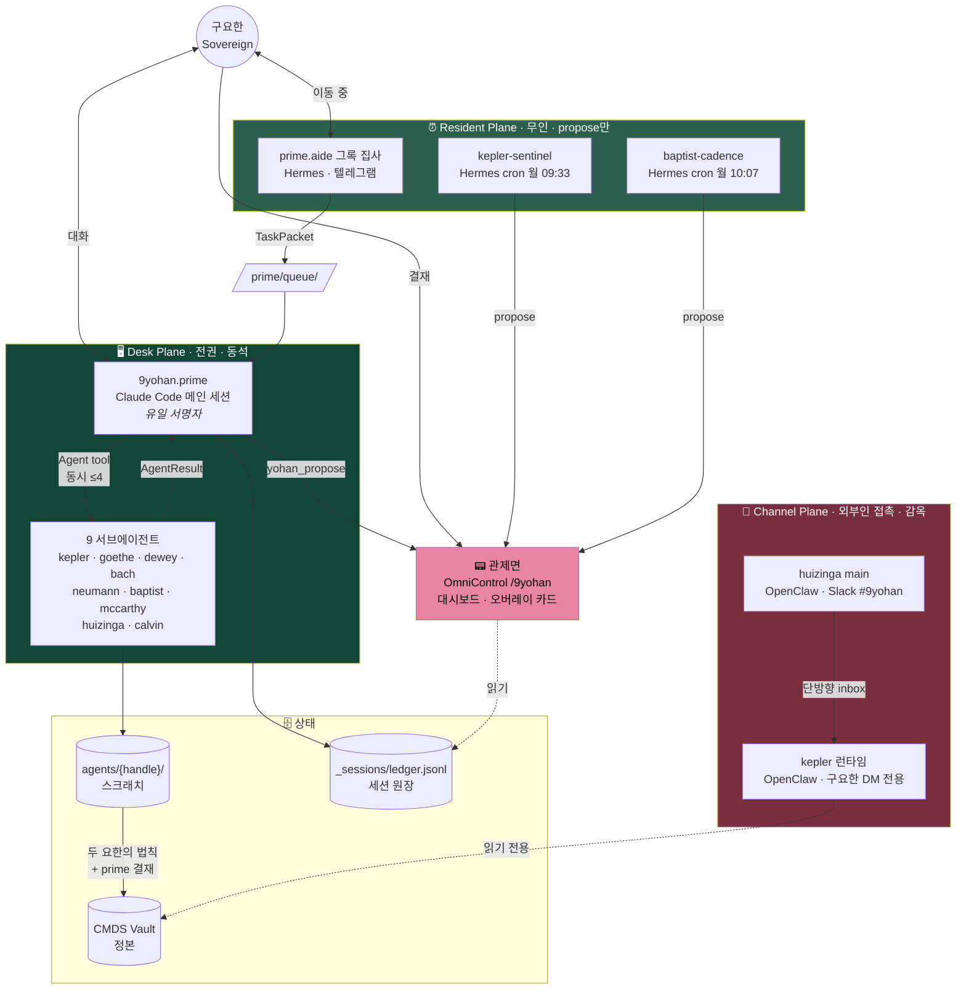
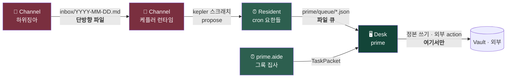
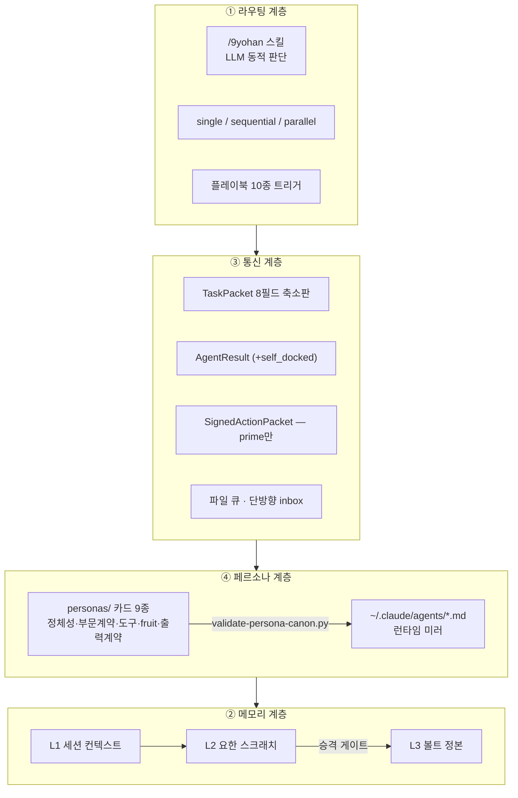
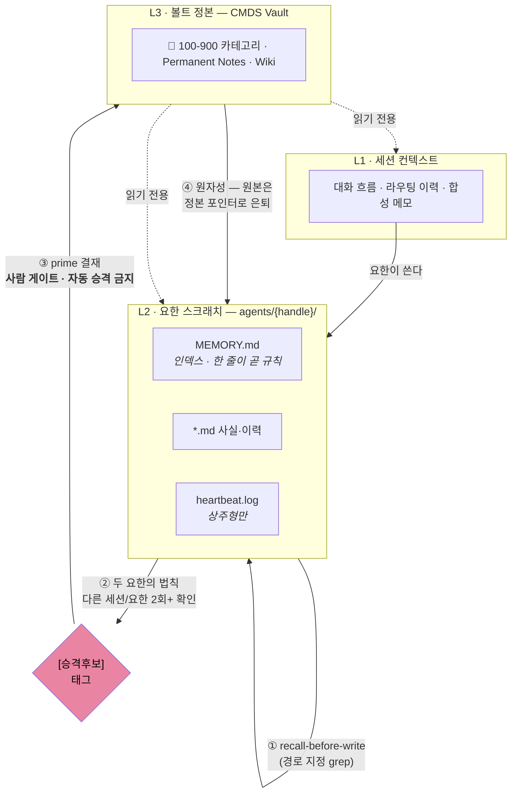
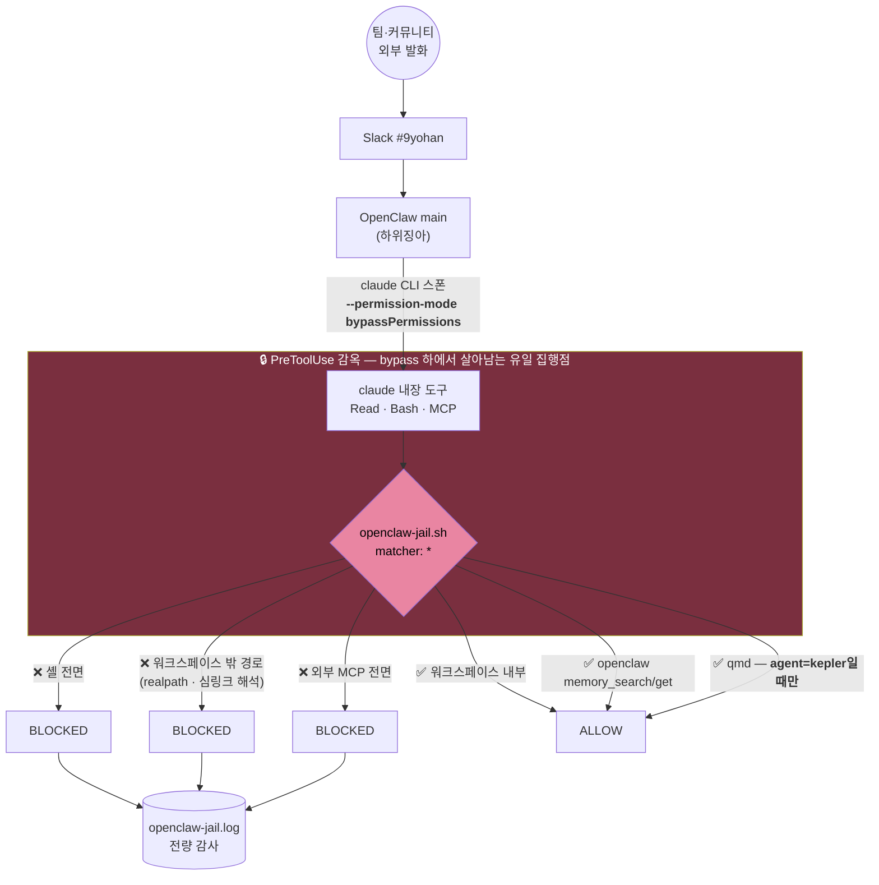
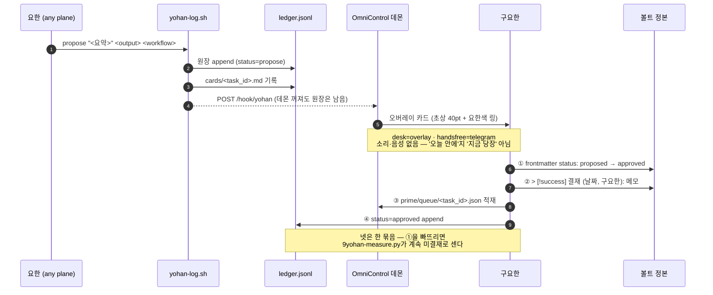

# 9요한 오케스트레이션 아키텍처

> **이 문서의 지위**: 실제로 굴러가는 시스템의 기술 정본. 정체성은 [[canonical]], 배치 결정은 [[2026-08-23-mbp-constellation-implementation-plan]], 운영 규약은 [[9YOHAN-OPERATIONS]], 사고는 [[9YOHAN-INCIDENTS]].
> **2026-08-24 전면 개정**: 4월 설계의 단일 star 모델을 **3-plane 모델**로 대체. 4월 판본의 잠정 가설(OpenClaw=런타임 / Hermes=전령, Studio 상주)은 §9에 보존 기록으로 남긴다.

---

## 0. 한 장 요약



한 문장: **책상 평면만 서명하고, 상주 평면은 제안만 하고, 채널 평면은 감옥 안에 있다.**

---

## 1. 3-Plane 토폴로지

### 1.1 왜 star 하나로는 부족해졌나

4월 설계는 "9요한 중심 star + 선택적 mesh" 하나였다. 이 모델의 암묵 가정은 **모든 노드가 같은 신뢰 등급**이라는 것 — 전부 내가 부르고, 내가 보고, 내 컴퓨터에서 돈다.

8월에 이 가정이 세 번 깨졌다:

1. **무인 cron이 생겼다** (센티널·cadence) — 내가 안 볼 때 돈다. 유령 자동화가 가능해졌다 ([[9YOHAN-INCIDENTS|INCIDENTS]] 001·002·003).
2. **팀이 생겼다** (구요한 외 팀 2인) — 내가 아닌 사람이 에이전트에게 말을 건다.
3. **채널 봇이 생겼다** (하위징아 Slack 상주) — 외부인 발화가 곧 프롬프트다. 감옥이 필요해졌다 (INCIDENTS 004).

그래서 star를 **신뢰 경계가 다른 3개 평면**으로 쪼갰다. 평면 안에서는 여전히 star다.

### 1.2 평면 정의

| 평면 | 누가 말을 거는가 | 서명 권한 | 볼트 접근 | 격리 |
|---|---|---|---|---|
| 🖥 **Desk** (책상) | 구요한 본인, 동석 | ✅ **prime 단독 서명** | 전체 R/W | 불필요 (유저 동석) |
| ⏰ **Resident** (상주) | 아무도 — cron이 깨움 | ❌ propose까지 | R + 자기 스크래치 W | 라이브니스 스탬프 의무 |
| 💬 **Channel** (채널) | 팀·커뮤니티 (외부인 가능) | ❌ 발신 불가 | **워크스페이스만** | ✅ **PreToolUse 감옥 (강제)** |

### 1.3 평면 간 이동 규칙



**불변식**: 평면 간 이동은 **항상 파일을 경유한다.** 직접 호출이 없다.

왜 파일인가 — 세 가지가 공짜로 따라온다. ① 감사 흔적이 자동으로 남는다 ② 수신측이 죽어 있어도 유실되지 않는다 ③ 신뢰 경계를 넘는 지점이 `ls` 한 번으로 보인다. 소켓이나 직접 API로 연결했다면 셋 다 직접 만들어야 했다.

---

## 2. 런타임 바인딩

### 2.1 배치표 (2026-08-24 현재)

| 요한 | 평면 | 런타임 | 모델 | 형태 | 라이브 |
|---|---|---|---|---|---|
| **9yohan.prime** | Desk | Claude Code 메인 + `/9yohan` 스킬 | Fable 5 | 대화형 · 유일 서명 | ✅ |
| **prime.aide** (그록 집사) | Resident | Hermes 게이트웨이 · 텔레그램 | grok-4.3 | 핸즈오프 접수 | ✅ |
| `kepler.map` | Desk + Resident + Channel | CC 서브 · Hermes cron · OpenClaw `kepler` | Fable 5 / grok-4.3 | 소환 + 센티널 + DM 리더 | ✅ |
| `goethe.sense` | Desk | CC 서브에이전트 | Fable 5 | 소환형 | ✅ |
| `dewey.learn` | Desk | CC 서브에이전트 | Sonnet 5 | 소환형 | ✅ |
| `bach.score` | Desk | CC 서브에이전트 | Sonnet 5 | 소환형 | ✅ |
| `neumann.compute` | Desk | **Codex CLI** | gpt-5.6-sol ultra | 소환 + 적대 검증 | ✅ |
| `baptist.prepare` | Resident | Hermes cron (월 10:07) | grok-4.3 | 무인 cadence | ✅ |
| `mccarthy.reason` | Desk | CC 서브 (+codex-rescue) | Fable 5 | 소환형 | ✅ |
| `huizinga.play` | **Channel** | **OpenClaw `main`** · Slack | claude 계열 | 채널 상주 · **감옥** | ✅ |
| `calvin.advise` | Desk | CC 서브에이전트 | Fable 5 xhigh | 소환형 · 감사 주관 | ✅ |

> `kepler.map`만 3개 평면에 모두 존재한다. **평면마다 권한이 다르다** — 책상의 케플러는 볼트 R/W, 채널의 케플러는 볼트 읽기 + 자기 스크래치만. 같은 페르소나라고 같은 권한이 아니다.

### 2.2 런타임 파일 위치

| 종류 | 경로 | 정본? |
|---|---|---|
| 서브에이전트 정의 9종 | `~/.claude/agents/{handle}.md` | 미러 (정본 = `1. Identity/personas/`) |
| 라우터 스킬 | `~/.claude/skills/9yohan/` | 미러 (정본 = 이 폴더) |
| 감옥 훅 | `~/.claude/hooks/openclaw-jail.sh` | 실행물 (정본 = [[9YOHAN-SECURITY]]) |
| 그록 집사 프롬프트 | `~/.hermes/SOUL.md` | 실행물 |
| cron 잡 | `hermes cron list` | 실행물 |
| 정체성 레지스트리 | `DEV/9yohan-constellation/ops/yohan-registry.json` | 실행물 (링 색·크롭) |

---

## 3. 하네스 4계층

4월의 4계층 구분(라우팅·메모리·통신·페르소나)은 유효하다. 각 계층에 8월의 현실을 채운다.



### 3.1 라우팅 계층

**결정 방식**: LLM 기반 동적 라우팅. 구현체는 `~/.claude/skills/9yohan/SKILL.md`.

흐름: 입력 수신 → `intent`·`artifact_type`·`urgency`·`complexity`로 구조화 → 9 프로파일 대조 → `single`/`sequential`/`parallel` 산출 → dispatch.

```
당신은 9요한, 구요한의 메타 에이전트입니다.
아래 9명 중 누구에게 이 요청을 맡길지 결정합니다.
(정본 canonical.md 기준 · 9 Johns × 9 Fruits 1:1:1)

- kepler.map (901 · 온유)        연구·PKM·문헌·매핑     [연구, 볼트, 문헌, 리뷰, 매핑]
- goethe.sense (902 · 사랑)      글쓰기·출판·뉴스레터    [편집, 뉴스레터, 발행, 글, 에세이]
- dewey.learn (903 · 자비)       교육·커리큘럼·교수법    [강의, 커리큘럼, 수업, 워크숍, 교육]
- bach.score (904 · 희락)        창작·음악·영상·디자인   [영상, 음악, 디자인, 썸네일, 작곡]
- neumann.compute (905 · 절제)   연구방법·통계·ML       [데이터, 분석, 통계, 예측, 모델]
- baptist.prepare (906 · 오래참음) 파트너십·네트워크      [이메일, 제안, 고객, 파트너, 외부]
- mccarthy.reason (907 · 양선)   개발·자동화·인프라      [코드, 플러그인, API, 배포, 시스템]
- huizinga.play (908 · 화평)     이벤트·커뮤니티        [이벤트, 스터디, 운영, 모임, 놀이]
- calvin.advise (909 · 충성)     컨설팅·조언·기관 자문   [컨설팅, 전략, 진단, 로드맵, 기업]

요청: {user_input}

판단: 단일 명확 → single · 산출이 다음 입력 → sequential · 독립 서브태스크 → parallel
출력(JSON): {"intent","routing","agents","reasoning"}
```

**동시 4명 상한**이 라우터에 하드코딩돼 있다. 5명 이상은 순차 분할.

### 3.2 메모리 계층 — 3층 + 승격 게이트



| 계층 | 위치 | 접근권 |
|---|---|---|
| L1 Session | prime 세션 윈도우 | prime만 R/W |
| L2 Scratch | `00. Inbox/03. AI Agent/agents/{handle}/` | 해당 요한만 R/W |
| L3 Vault | CMDS Vault 전체 | 전원 R · **prime 결재 후에만 W** |

**금지**: Mem0류 자동 추출을 이 경로에 부착하지 않는다. 파생층이 정본을 자동으로 바꾸는 순간 정본이 아니다.
**KPI**: 재교정률 (30일+ 후 같은 교훈 재교정, 목표 0). **메모리 개수는 지표가 아니다.**
**삭제**: 정본 삭제 시 [[9YOHAN-OPERATIONS]] §4 전파 체크리스트 4단계를 같은 작업 안에서 완료.

> ⚠️ **함정 (INCIDENTS 계보)**: 페르소나 규약의 "쓰기 전 함대 전수 grep"을 9,383개 md 볼트에서 문자 그대로 실행하면 컨텍스트가 터진다 (단어 1개 grep = 111파일·54KB). recall-before-write는 **경로를 지정한** grep이다. 2026-08-23 baptist 런이 이걸로 산출물 0을 냈다.

### 3.3 통신 계층

**기본**: 평면 안에서는 star (모든 메시지가 prime 경유). **평면 사이**는 파일 큐.

메시지 규격 전문은 [[schemas]]. 8월 확정 사항:

- **TaskPacket은 8필드 축소판** — 20필드 원판은 5/11 감사 권고로 폐기.
- **AgentResult에 `self_docked` 필수** — 스스로 기각한 주장의 기록. 신뢰 화폐.
- **SignedActionPacket은 prime만** — 요한도 aide도 서명 불가.

### 3.4 페르소나 계층

각 요한 = system prompt + tool set + memory namespace. 카드 5블록(정체성·부문 계약·도구·fruit_injection·출력 계약)은 [[personas/README]] 규약.

**드리프트 방어**: `scripts/validate-persona-canon.py`가 볼트 정본 ↔ 레포 미러를 대조. 미러 후 매번 실행.

---

## 4. 신뢰 경계 · 감옥

> 전문은 [[9YOHAN-SECURITY]]. 여기서는 아키텍처적 위치만.

채널 평면은 **외부인 발화가 곧 프롬프트**다. 그래서 경계가 규율이 아니라 **강제**여야 한다.



**왜 설정으로 안 되는가**: OpenClaw가 claude CLI를 `bypassPermissions`로 스폰한다. `openclaw.json`의 `tools.fs.workspaceOnly`도, `settings.json`의 `permissions.deny`도 claude 내장 도구에 **적용되지 않는다**. 문서상 '규율'이었던 경계가 3-프로브 적대 테스트에서 3건 전부 통과했다 (INCIDENTS 004, **사용자가 발견**).

**권한 분리**: 한 봇에 몰지 않았다. 볼트 전체 개방과 팀 상주가 한 봇에서 동시에 성립하면 **발신자 게이트 하나에 볼트 전체가 걸린다**.

| 에이전트 | 라우팅 | 읽기 | 쓰기 |
|---|---|---|---|
| `main` 🎪 하위징아 | `#9yohan` 채널 (팀 참여) | 자기 워크스페이스만 | 자기 워크스페이스만 |
| `kepler` 🪐 케플러 | 구요한 DM 전용 | 볼트 2종 + 하위징아 워크스페이스(단방향) | 자기 워크스페이스 + `agents/kepler-map/` |

---

## 5. 관제면 · 결재 루프

> 전문은 [[9YOHAN-CONTROL-PLANE]].

설계 원칙은 **시간상수 분리**다. 실시간으로 나를 찾아와야 하는 것(결재 대기)은 OmniControl 기존 대기 큐에 합류시키고, 회고형 조망(누가 언제 얼마나 돌았나)만 새 화면으로 뺐다. **알림 경로를 두 개 만들면 둘 중 하나는 반드시 썩는다.**



**결재 버튼은 propose-don't-commit이다** — 대시보드 버튼이 작업을 실행하지 않는다. 실행은 다음 prime 런이 큐를 집어갈 때.

| 면 | 위치 | 성격 |
|---|---|---|
| 대시보드 | `cmux-voice 9yohan` → `/9yohan` | 3×3 별자리 보드. **위치 고정**(좌상단=케플러), 채도가 수요 |
| 오버레이 카드 | `yohan_propose` 이벤트 | 초상 40pt + 요한색 링 |
| 폰 | Tailscale serve `/9yohan` (8443) | 홈화면 추가 시 앱처럼 |

---

## 6. 관찰성 · 세션 원장

모든 요한 런은 종료 **즉시** 1행 기록. 일괄 소급 금지 (동일 ts 다발 = 누락을 낳는 관행, 감사 플래그).

```bash
scripts/yohan-log.sh <handle> <task_id> <status> "<summary>" [output] [workflow]
# status: done | failed | partial | propose
# task_id: <workflow>-<YYYYMMDD>-<yohan|slug>   예: pb01-20260823-kepler
```

**재개 절차** (후속 세션이 이어받는 법):
1. `sessions/ledger.jsonl`에서 해당 handle 최근 행
2. `sessions/cards/<task_id>.md`
3. 카드의 output 경로(요한 스크래치) + 그 요한의 `MEMORY.md`

**추적 필드** (W3C Trace Context + 고유):

| 필드 | 예시 | 용도 |
|---|---|---|
| `task_id` | `pb01-20260823-kepler` | 최상위 작업 |
| `trace_id` | `00-0af7-…` | 분산 추적 |
| `run_id` | `run_001_kepler` | specialist별 실행 단위 |
| `idempotency_key` | `idem_20260823_0001` | 외부 action 중복 방지 |
| `cmds_stage` | `merge` | CMDS Process 위치 |
| `fruit_invoked` | `사랑 · 온유` | 품질 게이트 참조 |
| `self_docked` | `["단정 1건 철회"]` | 자진 기각 (신뢰 화폐) |

**라이브니스**: 상주 잡은 성공·무사건이어도 heartbeat 스탬프를 남긴다. **부재 ≠ 정상** (INCIDENTS 001·002의 제도화). Hermes cron 잡은 `hermes cron list`의 Last run + 배달 실물이 라이브니스 정본.

---

## 7. 호출 패턴

| Primitive | 정의 | 예시 |
|---|---|---|
| **Single** | prime → 1인 → 반환 | "오늘 미팅 노트 정리" → 케플러 |
| **Sequential** | A 산출이 B 입력 | "강의 커리큘럼" → 케플러 → 듀이 → 괴테 |
| **Parallel** | 동시 호출 후 합성 (≤4) | "제안서" → [칼뱅 ∥ 노이만 ∥ 케플러] → 괴테 |
| **Control Loop** | Plan-Execute-Verify 순환 | 외부 action 있는 복합 작업 |

상세 흐름·결정 트리는 [[workflows]], 실전 시나리오 10종은 [[playbooks]].

---

## 8. 안티 패턴 (하지 말 것)

1. ❌ 요한이 prime 승인 없이 외부 action
2. ❌ 요한이 다른 요한을 직접 소환 (핸드오프는 next action **제안**)
3. ❌ prime이 위임 없이 직접 전문 작업
4. ❌ 동시 5명 이상 활성화
5. ❌ 같은 입력으로 non-deterministic recursion
6. ❌ 세션 메모리에 PII/비밀 평문
7. ❌ TaskPacket 스키마 없는 ad-hoc 메시지
8. ❌ **알림 경로 신설** — 관제는 OmniControl 한 곳 (둘 만들면 하나는 썩는다)
9. ❌ **계기판 신설** — 위클리 리뷰 기존 섹션에 합류 ([[9YOHAN-OPERATIONS]] §6)
10. ❌ **데몬을 tailnet에 직접 바인딩** — `/command`가 토큰 하나만 믿고 함께 열린다
11. ❌ 볼트 전수 grep (경로 지정 필수 — §3.2 함정)

---

## 9. 보존 기록 — 4월 잠정 가설 (폐기)

> 아래는 2026-04~05 판본의 내용. **현행 아님.** 계보 추적용으로만 남긴다.

**OpenClaw vs Hermes 잠정 역할 분담** — "OpenClaw=에이전트 실행 런타임 / Hermes=메시지 전달 레이어(전령)". → 8/23 D3·D5로 대체: **Hermes = 유일 exec plane + 상주 감시병**, **OpenClaw = 채널 플레인**(하위징아·케플러 런타임).

**Multi-Machine Topology** — "MBP=dev / Mac Studio=runtime 24/7 호스트". → 8/23 **D1로 폐기**: prime은 Claude Code 메인 세션이고 커널은 유저가 사는 곳에 있어야 한다. 30일 세션 1,888건 실측에서 실주거지가 MBP의 Claude Code로 나왔다. 이번 회차는 **MBP 완결**.

**5-Phase 로드맵** (Phase 0 매카시 프로토타입 → Phase 4 역할 분담 확정) → [[2026-08-23-mbp-constellation-implementation-plan]] §4의 3-Phase로 대체.

---

## 🔗 관련

- [[README]] · 마스터 인덱스
- [[canonical]] · 정체성 정본
- [[constellation]] · 에이전트 운영 정의 (system prompt·도구)
- [[2026-08-23-mbp-constellation-implementation-plan]] · 배치·권한 결정
- [[9YOHAN-SECURITY]] · 감옥·신뢰 경계 정본
- [[9YOHAN-CONTROL-PLANE]] · 관제면·결재 루프·세션 원장 정본
- [[9YOHAN-OPERATIONS]] · 운영 규약
- [[9YOHAN-INCIDENTS]] · 사고 원장
- [[workflows]] · 협업 패턴 · [[playbooks]] · 시나리오 · [[schemas]] · 메시지 규격
