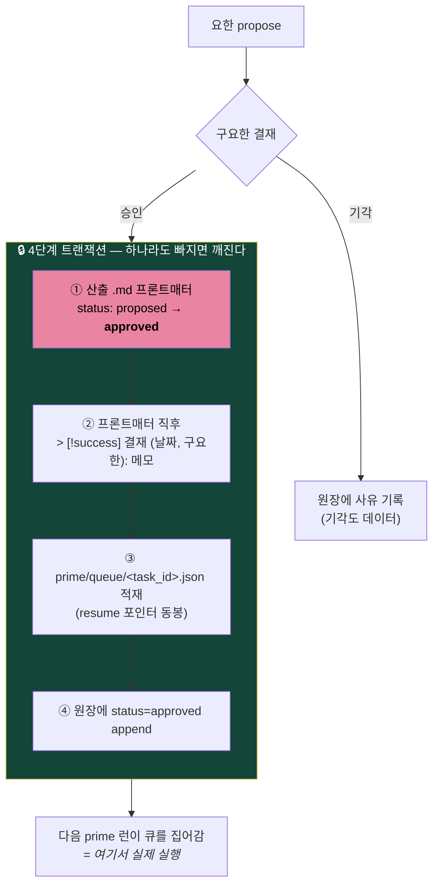
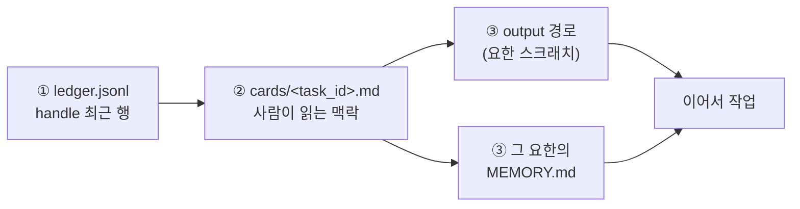

> [!info] 이 문서는 볼트 정본의 **공개 미러**입니다
> 정본은 CMDS 볼트 `70. Outputs/74. Projects/9yohan Constellation/3. Operations/9YOHAN-CONTROL-PLANE.md`.
> 공개본에서는 식별자(채널 ID · 호스트명 · chat_id · 로컬 경로 · 팀원 실명)가 치환되었습니다.
> 편집은 볼트에서 하고 `scripts/mirror-docs.py`로 다시 미러하세요.

# 9YOHAN-CONTROL-PLANE — 관제면·결재 루프 정본

> 아키텍처적 위치는 [[architecture]] §5·§6. 실행 절차·현재 포트는 레포 `ops/RUNBOOK.md` (이 문서의 미러).
> 운영 규약(불변식·라이브니스·승격 게이트)은 [[9YOHAN-OPERATIONS]].

---

## 1. 설계 원칙 — 시간상수 분리

관제면을 만들 때 가장 쉬운 실수는 **"9요한 전용 알림 시스템"을 새로 만드는 것**이다. 하지 않았다.

기준은 **시간상수**다:

| 시간상수 | 무엇 | 어디로 |
|---|---|---|
| **실시간** — 나를 찾아와야 함 | 결재 대기 (propose) | **OmniControl 기존 대기 큐·채널에 합류** |
| **회고형** — 내가 찾아가면 됨 | 누가 언제 얼마나 돌았나 | 새 화면 (`/9yohan` 대시보드) |

> **알림 경로를 두 개 만들면 둘 중 하나는 반드시 썩는다.** 안 보는 쪽이 생기고, 그쪽에 쌓인 것이 유령이 된다. 그래서 결재는 이미 매일 보는 곳으로 보냈다.

같은 논리의 자매 규칙 — [[9YOHAN-OPERATIONS]] §6: **계기판 신설 금지**, 위클리 리뷰 기존 "사람 결정" 섹션에 합류.

---

## 2. 세 개의 노출면

| 면 | 위치 | 성격 |
|---|---|---|
| **대시보드** | `cmux-voice 9yohan` → `http://127.0.0.1:<port>/9yohan` | 3×3 별자리 보드 |
| **오버레이 카드** | `yohan_propose` 이벤트 | 초상 40pt + 요한색 링 |
| **폰** | Tailscale serve `/9yohan` (8443) | 홈화면 추가 시 앱처럼 |

### 2.1 대시보드 — 왜 3×3 고정 배치인가

**위치가 정보다.** 좌상단은 항상 케플러(901), 우하단은 항상 칼뱅(909) — 부문 번호 순으로 고정. 정렬(최근순·바쁜순)을 넣지 않았다.

정렬을 넣으면 매번 다른 자리에 다른 얼굴이 온다. 그러면 **읽을 때마다 라벨을 읽어야 한다.** 고정 배치는 3주쯤 지나면 위치만으로 누군지 안다 — 눈이 라벨을 건너뛴다.

**채도가 수요다**:

| 상태 | 표현 |
|---|---|
| 결재 대기 (`propose`) | **풀컬러 + 핑크 글로우** |
| 최근 활동 | 컬러 |
| idle | 탈색 |

색이 "예쁘게"가 아니라 **"나한테 볼일 있음"** 을 뜻하도록 한 채널에 몰아넣었다.

### 2.2 오버레이 카드 — 직교 채널

```
좌측 바 · 심볼   →  상태 (제안/진행/실패)
초상 · 링 색     →  정체성 (누가)
```

**상태와 정체성을 서로 다른 시각 채널에 분리**했다. 같은 채널(예: 색 하나)에 둘 다 실으면 "빨간 게 칼뱅인지 실패인지" 매번 되짚게 된다.

**라우팅**: `desk=["overlay"]` · `handsfree=["telegram"]`
**소리·음성 없음** — 요한 결재는 '오늘 안에'지 '지금 당장'이 아니다. 소리를 붙이면 3일 만에 끈다.

---

## 3. 결재 루프

### 3.1 상신

```bash
scripts/yohan-log.sh <handle> <task_id> propose "<요약>" <output> <workflow>
```

이 한 줄이 세 가지를 한다:

1. `sessions/ledger.jsonl`에 원장 1행 append
2. `sessions/cards/<task_id>.md` 세션 카드 기록
3. 데몬에 `/hook/yohan` POST 상신

**데몬이 꺼져 있어도 원장은 남는다** (전송은 best-effort). 순서가 중요하다 — 기록이 먼저, 알림이 나중. 반대였으면 데몬 다운이 곧 기록 유실이다.

### 3.2 승인 — 넷은 한 묶음이다

**대시보드 버튼은 propose-don't-commit이다. 누른다고 실행되지 않는다.**



> ⚠️ **①을 빠뜨리면 `9yohan-measure.py`가 계속 미결재로 센다.** 계약이 **`PROPOSE` 문자열 + `status: proposed` 동시 존재**이기 때문. 카운터가 안 줄면 위클리에서 "결재 0건 = 미검토"로 셈해 병목이 사람인 것처럼 보인다 — 실제로는 트랜잭션이 반쯤 열린 것.

### 3.3 왜 사람 게이트를 자동화하지 않는가

AKM 4회차에서 내 "사람 결정" 점수가 0.25점이었다. 기계가 못 돌아서가 아니라 **내가 안 봐서**다. 그 진단을 제도화한 게 이 루프다.

- **결재 0건인 주는 "미검토"로 셈한다** — 0건을 "안건 없음"으로 처리하면 병목이 통계에서 사라진다.
- **자동 승격 금지** — 승격 게이트에 Mem0류 자동 추출을 부착하지 않는다 ([[9YOHAN-OPERATIONS]] §3).

---

## 4. 세션 원장 규약

### 4.1 기록 의무

prime(라우터)은 **요한 런이 끝날 때마다 1회** `yohan-log.sh` 호출.

| 필드 | 값 |
|---|---|
| `status` | `done` \| `failed` \| `partial` \| `propose` |
| `task_id` | `<workflow>-<YYYYMMDD>-<yohan\|slug>` — 예: `pb01-20260823-kepler` |
| `summary` | 한 문장. **큐·산출물 위치는 실제 경로로 명시** |
| `output` | 요한 스크래치 상대 경로 |

**일괄 소급 기록 금지** — 런 종료 즉시 개별 기록. 동일 ts 다발은 누락을 낳는 관행이고 감사 플래그 대상이다 (audit-r1 F5).

**"큐 적재"만 쓰지 말 것** — prime 큐인지 maintenance-queue인지 판별 불가 (F2 재발 방지).

### 4.2 재개 절차 — 원장의 존재 이유

원장은 감사 기록이 아니라 **재개 포인터**다. 세션이 죽어도 다음 세션이 이어받게 하는 것.



### 4.3 물리적 위치와 백업

| | |
|---|---|
| 정본 | 볼트 `00. Inbox/03. AI Agent/agents/_sessions/` |
| 레포 `sessions/` | **심링크 → 볼트** |
| git | `.gitignore` — **퍼블릭 원격 미전송** |
| 백업 | 마더십 git+NAS 일일 잡이 커버 |

원장에는 미발행 산출 요약·팀 맥락이 섞인다. 퍼블릭 레포에 올라가면 회수가 안 된다. 그래서 심링크 + gitignore이고, 백업은 볼트 쪽 잡에 맡긴다.

---

## 5. 주간 지표 3종

`~/.claude/scripts/weekly-measure-all.sh` (일 21:23) → `9yohan-measure.py` → `~/.claude/logs/9yohan-measure.jsonl`

| 지표 | 산출 방식 |
|---|---|
| **요한별 발동 수 (7d)** | 최근 7일 세션 jsonl에서 `"subagent_type":"<handle>"` 보유 파일 수 |
| **propose 미결재** | 스크래치 md 중 `PROPOSE` 블록 + `status: proposed` 동시 보유 |
| **재교정률** | 30일+ 후 같은 교훈 재교정 건수 (목표 0) |

부가: 큐 깊이 · heartbeat 신선도.

> **실패해도 행을 남긴다.** 유령 벤치 사건(INCIDENTS 001)의 원인이 "무조건 done 스탬프"였으므로, 이 스크립트는 `ok: false` 행을 남기도록 만들었다. **부재 ≠ 정상.**

---

## 6. 정체성 레지스트리 · 초상 타일

### 6.1 왜 레지스트리가 별도 파일인가

오버레이 카드와 대시보드가 **같은 요한을 같은 색·같은 얼굴로** 그려야 한다. 두 곳에 색을 하드코딩하면 반드시 갈라진다.

`ops/yohan-registry.json` — 단일 원천:

```json
"kepler-map": {
  "division": "901", "name": "케플러", "fruit": "온유",
  "ring": "#5B6FE0",
  "crop": [0.06, 0.33, 0.34, 0.34],
  "source": "assets/yohans/901-kepler-map.png"
}
```

- `ring` — 초상 지배색의 **hue는 유지한 채 S/V를 올린 값**. 다크 카드 위에서 읽히게 하기 위함.
- `crop` — `[x,y,w,h]` 정사각 원본에 대한 비율. **40px에서 읽히도록 손으로 정한** 포컬 사각형.

### 6.2 왜 런타임 크롭이 아니라 빌드 타임인가

데몬은 **표준 라이브러리 전용**이라 이미지 처리를 못 한다. 그래서 미리 굽는다.

그리고 자동 중앙 크롭이 안 된다 — 초상 9장은 정사각이지만 **초점이 제각각**이다. 세례요한은 인물이 화면의 15%라 중앙 크롭하면 얼굴이 사라진다.

```bash
python3 scripts/build-yohan-tiles.py          # 굽기 (80/240px)
python3 scripts/build-yohan-tiles.py --check  # 검증만
```

> **초상을 교체하면 반드시 재실행.** 안 하면 데몬이 옛 타일 바이트를 계속 서빙한다.

---

## 7. 폰 접속 — Tailscale 경로 마운트

```bash
tailscale serve --bg --https=8443 --set-path=/9yohan http://127.0.0.1:8765/9yohan
tailscale serve --https=8443 off        # 되돌리기
```

`https://<tailnet-host>:8443/9yohan?token=…` — 홈화면에 추가하면 앱처럼 뜬다 (파비콘·테마색 포함). CmdPilot(`*:80/443/8766`)과 겹치지 않게 **8443**.

### 7.1 하지 말 것 두 가지

**① 데몬을 tailnet에 직접 바인딩하지 말 것.**

`bridge/server.py`는 `127.0.0.1`에만 바인딩돼 있고 그대로 두어야 한다. 호스트를 열면 `/9yohan`만 열리는 게 아니다 — `/command`(**살아있는 cmux 세션에 명령 주입**)·`/ptt`·`/config`·`/transcribe`가 토큰 하나만 믿고 tailnet에 함께 열린다.

serve **경로 마운트**는 `/9yohan` 프리픽스만 프록시하므로 나머지는 404로 남는다 (실측 확인).

**② `Tailscale-User-Login` 헤더를 인증으로 승격하지 말 것.**

Tailscale이 넣어주는 헤더라 인증에 쓰고 싶어지지만 함정이다 — 로컬 프로세스가 127.0.0.1로 직접 붙으면서 **같은 헤더를 위조**할 수 있고, 데몬은 그게 serve를 통과한 요청인지 구분할 수 없다. **토큰을 그대로 쓴다.**

> 같은 계열의 판단: [[9YOHAN-SECURITY]] §2 — "그럴듯한 방어가 실제로는 무효인 경우". 경계는 **집행 가능한 지점**에만 세운다.

---

## 8. 장애 시 동작 (degradation)

| 죽은 것 | 결과 | 복구 |
|---|---|---|
| OmniControl 데몬 | 원장은 정상 기록, 오버레이 카드만 유실 | `cmux-voice` 재기동 후 원장에서 미결재 재확인 |
| Tailscale serve | 폰 접속 불가, 데스크 정상 | `tailscale serve` 재마운트 |
| `yohan-log.sh` 실패 | **런 자체는 성공했는데 기록 없음 = 유령** | 즉시 수동 append + INCIDENTS 행 |
| 타일 미갱신 | 옛 얼굴 서빙 | `build-yohan-tiles.py` 재실행 |

---

## 🔗 관련

- [[architecture]] §5·§6 · 아키텍처상 위치
- [[9YOHAN-OPERATIONS]] · §6 사람 결정 소비 표면 · §8 원장 기록 시점
- [[9YOHAN-SECURITY]] · 채널 평면 경계 (동일 계열 판단)
- [[9YOHAN-INCIDENTS]] · 001·002 (유령 자동화 — 라이브니스의 기원)
- [[2026-08-23-mbp-constellation-implementation-plan]] · §2 AKM 5교훈
- 레포 `ops/RUNBOOK.md` · 실행 절차 미러 · `ops/yohan-registry.json` · 레지스트리 실물
