# 9요한 Playbooks · 실전 시나리오 10선

> 구요한의 실제 업무 유형에 대응하는 템플릿. 새 작업이 이 중 하나의 패턴과 맞으면 해당 playbook을 참조해 9요한 라우팅 결정을 빠르게 재사용.
>
> 공통 규칙: [[workflows]] 참조 · 메시지 스키마: [[schemas]] 참조 · 에이전트 정의: [[constellation]]

---

## 📋 Playbook 목록

| # | 시나리오 | Primitive | 주 참여 요한 | 소요 시간 |
|---|--------|-----------|-----------|---------|
| 01 | 주간 뉴스레터 발행 | Sequential | 케플러 → 괴테 → 바흐 | 30~60분 |
| 02 | 컨설팅 제안서 (LG-AX 유형) | Parallel + Sequential | 칼뱅 ∥ 노이만 ∥ 케플러 → 괴테 | 2~4시간 |
| 03 | 기업 맞춤 강의 커리큘럼 | Sequential | 케플러 → 듀이 → 바흐 → 칼뱅 | 3~6시간 |
| 04 | 학술 문헌 리뷰·합성 | Sequential | 케플러 → 노이만 → 괴테 | 1~3시간 |
| 05 | 1on1 경영진 코칭 준비 | Parallel → Sequential | [칼뱅 ∥ 케플러 ∥ 노이만] → 괴테 | 1~2시간 |
| 06 | 파트너 미팅 준비 | Parallel | 세례요한 ∥ 케플러 | 20~40분 |
| 07 | 월간 옵시디언 세션 기획 | Sequential | 하위징아 → 듀이 → 괴테 → 바흐 | 1~2시간 |
| 08 | Obsidian 플러그인 개발 | Sequential (10-step Loop) | 매카시 → 노이만 → 매카시 | 반나절~3일 |
| 09 | 의료 AI 프로젝트 킥오프 | Control Loop | 전원 관여 (복합) | 1~2주 |
| 10 | 데이터 분석 리포트 | Sequential | 노이만 → 케플러 → 괴테 → 바흐 | 2~4시간 |

---

## Playbook 01 · 주간 뉴스레터 발행

### Trigger
"이번 주 뉴스레터 써줘" · "더배러 주간" · "뉴스레터 기획 좀"

### 9요한 Routing Decision
```json
{
  "intent": "주간 뉴스레터 발행",
  "routing": "sequential",
  "agents": ["kepler.map", "goethe.sense", "bach.score"],
  "reasoning": "인사이트 발굴(케플러) → 에세이 편집(괴테) → 헤더 이미지(바흐)의 선형 체인"
}
```

### Flow
1. **kepler.map**: 지난 7일 볼트 활동 스캔 → 가치 있는 인사이트 3~5개 추출 (출처 wikilink 포함)
2. **goethe.sense**: 주제 1개 선택 → 사랑의 문체로 에세이 작성 → 헤드라인 A/B 2안 제시
3. **bach.score**: 헤더 이미지 1개 생성 (에세이 분위기에 맞춰)
4. **9요한**: 최종 검토 · 사용자 승인 → `baptist.prepare`가 뉴스레터 플랫폼 발송

### Sequence Diagram
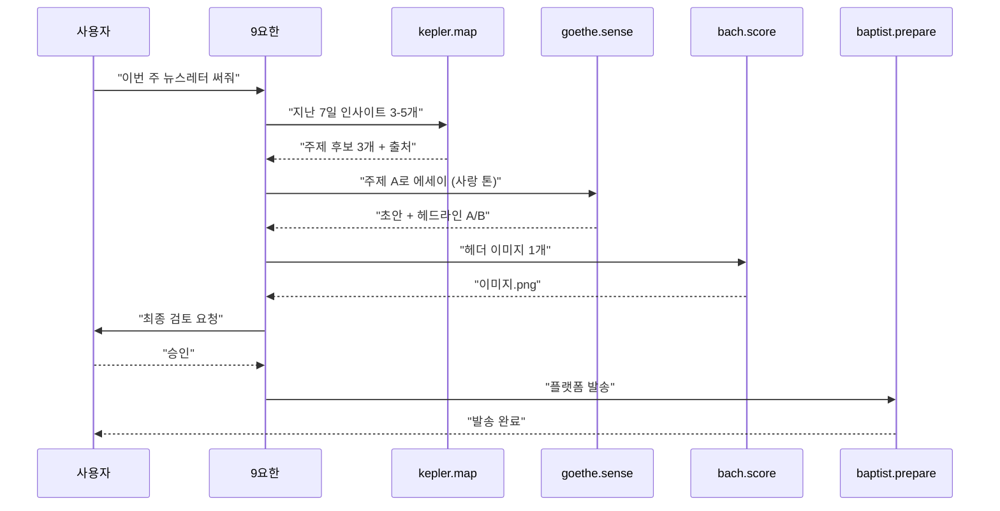

---

## Playbook 02 · 컨설팅 제안서 (LG-AX 유형)

### Trigger
"LG-AX 제안서 초안" · "SGI 교육 기획서" · "컨설팅 제안 작성"

### 9요한 Routing Decision
```json
{
  "intent": "기업 AX 컨설팅 제안서",
  "routing": "parallel_then_sequential",
  "agents": ["calvin.advise", "neumann.compute", "kepler.map", "goethe.sense"],
  "reasoning": "세 영역 병렬 조사(이해관계자·벤치마크·레퍼런스) 후 괴테가 최종 통합 편집"
}
```

### Flow
**병렬 단계** (세 요한 동시):
- **calvin.advise**: 클라이언트 이해관계자 지도 · 이슈 트리 · 권고 메모
- **neumann.compute**: AX 전환 벤치마크 데이터 · KPI 모델
- **kepler.map**: 볼트 내 유사 프로젝트 레퍼런스 · 과거 협업 이력

**순차 단계**:
- **goethe.sense**: 세 결과물 통합 → Executive Summary + 본문
- **bach.score** (선택): 핵심 슬라이드 구조 설계
- **9요한**: 최종 서명 · 가격/조건 검토
- **baptist.prepare**: 고객 발송

### Sequence Diagram
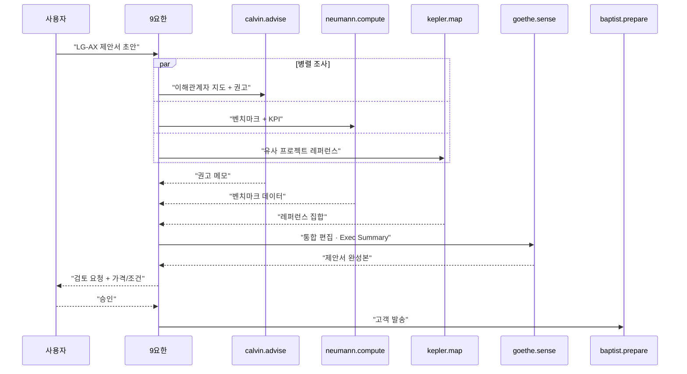

---

## Playbook 03 · 기업 맞춤 강의 커리큘럼

### Trigger
"○○기업 임원 교육 커리큘럼 짜줘" · "AX Camp 기획" · "패캠 새 강의"

### 9요한 Routing Decision
```json
{
  "intent": "기업 맞춤 강의 커리큘럼 설계",
  "routing": "sequential",
  "agents": ["kepler.map", "dewey.learn", "bach.score", "calvin.advise"],
  "reasoning": "배경 리서치 → 커리큘럼 설계 → 슬라이드 → 컨설팅 관점 검증"
}
```

**903 vs 909 분기 규칙**: 고객이 "기업"이면 909 (칼뱅 참여 필수) · "개인/불특정"이면 903만 (칼뱅 생략)

### Flow
1. **kepler.map**: 대상 조직 배경 · 산업 동향 · 기존 커리큘럼 자산 스캔
2. **dewey.learn**: 학습자 수준 가정 → 모듈화 (학습목표·사전지식·활동·평가)
3. **bach.score**: 슬라이드 구조 · 실습 데모 설계
4. **calvin.advise** (909 케이스만): 조직 체질 개선 관점 권고 · ROI 논리
5. **goethe.sense**: 최종 문서 편집 (제안서 포맷)
6. **9요한**: 가격 · 일정 확정 · 승인

### Sequence Diagram
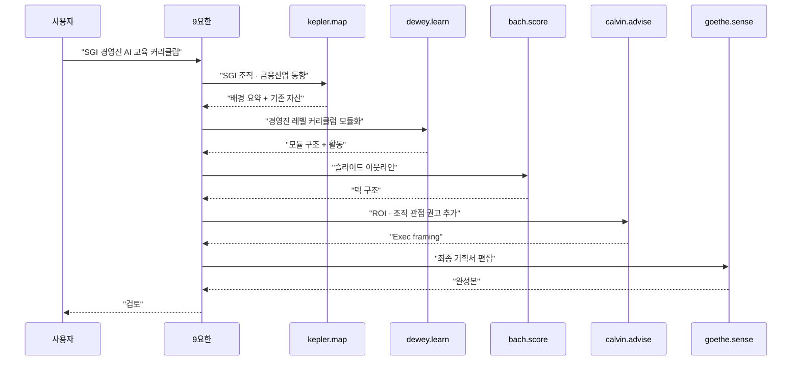

---

## Playbook 04 · 학술 문헌 리뷰·합성

### Trigger
"이 주제 문헌 리뷰" · "○○ 개념 합성 노트" · "리뷰 페이퍼 초안"

### 9요한 Routing Decision
```json
{
  "intent": "학술 주제 문헌 리뷰 합성",
  "routing": "sequential",
  "agents": ["kepler.map", "neumann.compute", "goethe.sense"],
  "reasoning": "볼트+외부 문헌 지도화 → 통계·메타분석 → 학술 문체 편집"
}
```

### Flow
1. **kepler.map**: 볼트 (201-210, 240) + LLM Wiki + qmd 검색 → 관련 문헌 집합
2. **neumann.compute** (선택): 메타분석 · 수치 추출
3. **goethe.sense**: 학술 문체 · 인용 체계 적용 (APA/MLA)
4. **9요한**: 논리 일관성 검토 · Vault `📚 210 Literature Reviews`에 저장

### Sequence Diagram
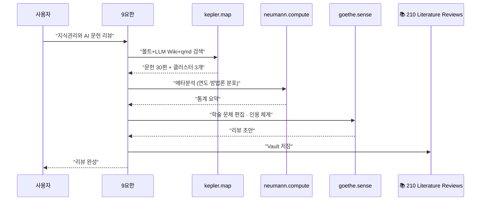

---

## Playbook 05 · 1on1 경영진 코칭 준비

### Trigger
"○○ 대표 1on1 준비" · "CEO 코칭 브리핑" · "임원 1:1"

### 9요한 Routing Decision
```json
{
  "intent": "경영진 1on1 코칭 준비",
  "routing": "parallel_then_sequential",
  "agents": ["calvin.advise", "kepler.map", "neumann.compute", "goethe.sense"],
  "reasoning": "세 영역 병렬(이해관계자·레퍼런스·데이터) 후 괴테가 브리핑 문서로 통합"
}
```

### Flow
**병렬**:
- **calvin.advise**: 클라이언트 역사 · 전 세션 메모 · 맞춤 권고
- **kepler.map**: 해당 산업/회사 최신 동향 · 관련 레퍼런스
- **neumann.compute**: 데이터 기반 벤치마크 · KPI 비교

**순차**:
- **goethe.sense**: 코칭 세션 스크립트 (1시간 · 15분 블록)
- **bach.score** (선택): 시각 자료 (대시보드 · 다이어그램)
- **9요한**: 세션 시나리오 · 대안 질문 세트 최종 서명

### Sequence Diagram
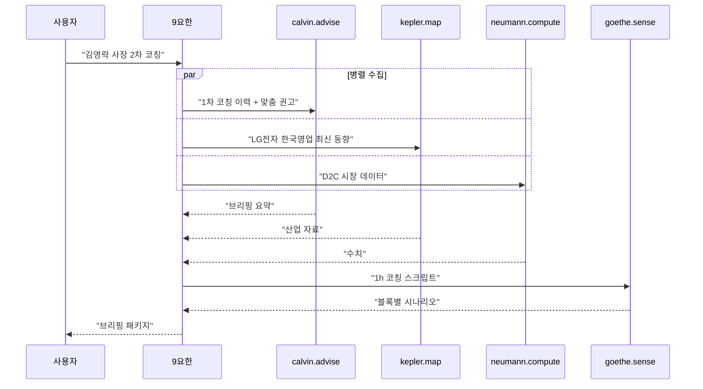

---

## Playbook 06 · 파트너 미팅 준비

### Trigger
"내일 ○○ 미팅 준비" · "미팅 브리핑"

### 9요한 Routing Decision
```json
{
  "intent": "파트너 미팅 준비",
  "routing": "parallel",
  "agents": ["baptist.prepare", "kepler.map"],
  "reasoning": "관계 맥락(세례요한) + 의제 리서치(케플러) 병렬"
}
```

### Flow
- **baptist.prepare**: 과거 대화 · 약속 · 공통 지인 · 관계 맥락 요약
- **kepler.map**: 오늘 의제 관련 볼트 자료 스캔
- **9요한**: 1페이지 미팅 노트 합성 (30분 전용)

### Sequence Diagram
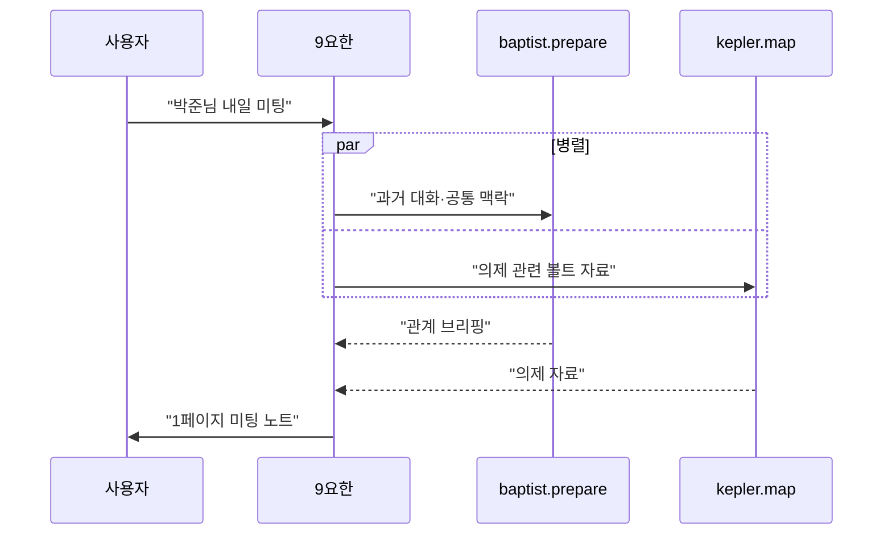

---

## Playbook 07 · 월간 옵시디언 세션 기획

### Trigger
"다음 회차 월간 옵시디언" · "커뮤니티 세션 기획"

### 9요한 Routing Decision
```json
{
  "intent": "커뮤니티 세션 기획",
  "routing": "sequential",
  "agents": ["huizinga.play", "dewey.learn", "goethe.sense", "bach.score"],
  "reasoning": "공동체 기획(하위징아) → 교육 설계(듀이) → 초대장(괴테) → 시각물(바흐)"
}
```

### Flow
1. **huizinga.play**: 참여자 여정 · 의례(onboarding/closing) · 역할 · 규칙
2. **dewey.learn**: 학습 목적 모듈 (실습 위주)
3. **goethe.sense**: 초대 공지 · 세션 소개 문안 (사랑 톤)
4. **bach.score**: 포스터 · 슬라이드 덱
5. **baptist.prepare**: 외부 모집 발송 (Slack · SNS)

### Sequence Diagram
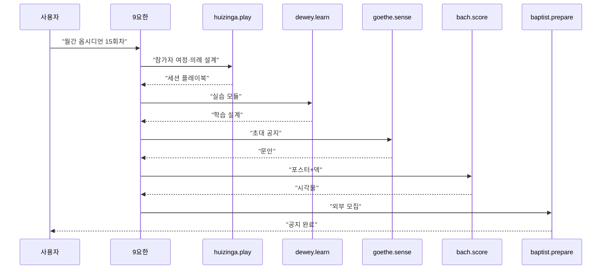

---

## Playbook 08 · Obsidian 플러그인 개발 (10-step Control Loop)

### Trigger
"○○ 플러그인 만들어줘" · "에이전트 스킬 작성"

### 9요한 Routing Decision
```json
{
  "intent": "플러그인 신규 개발",
  "routing": "control_loop",
  "agents": ["mccarthy.reason", "neumann.compute"],
  "reasoning": "복합 개발 작업 · 승인 게이트 포함 · 10-step loop"
}
```

### Flow (10-step)
1. **Intake**: 요구사항 수령
2. **Framing** (9요한): 성공 조건 (기능 · 성능 · 호환성)
3. **Mapping** (kepler.map): 유사 플러그인 조사
4. **Strategy** (9요한): 아키텍처 방향 결정
5. **Scoring** (mccarthy.reason + bach.score): 구현 DAG · 단계 분해
6. **Execute** (mccarthy.reason): 코딩 · 테스트
7. **Critique** (neumann.compute): 성능 · 품질 검증
8. **Package** (mccarthy.reason): README · 배포 준비
9. **Action**: GitHub · BRAT 업로드
10. **Learn**: 패턴 `📚 491 Codes`에 기록

### Sequence Diagram
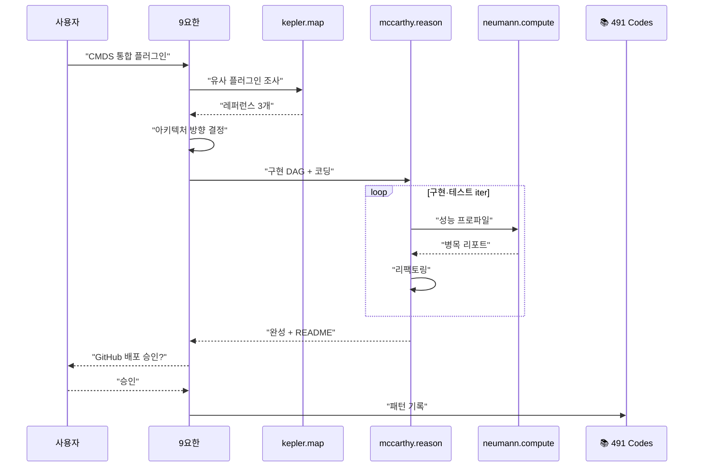

---

## Playbook 09 · 의료 AI 프로젝트 킥오프 (복합 · Control Loop)

### Trigger
"신세계병원 킥오프" · "더메디컬 프로젝트 준비" · "의료 AI 제안"

### 9요한 Routing Decision
```json
{
  "intent": "의료 AI 프로젝트 복합 킥오프",
  "routing": "control_loop",
  "agents": ["kepler.map", "calvin.advise", "neumann.compute", "goethe.sense", "bach.score", "baptist.prepare"],
  "reasoning": "전원 관여 복합 · 다단계 승인 · 외부 조직과 장기 파트너십"
}
```

### Flow (요약)
- **Phase A (배경 이해)**: 케플러(의료 도메인 리서치) · 칼뱅(이해관계자)
- **Phase B (제안 설계)**: 노이만(POC 데이터 설계) · 매카시(기술 스택)
- **Phase C (제안 패키징)**: 괴테(기획서) · 바흐(시각화)
- **Phase D (전달)**: 세례요한(발송) · 칼뱅(미팅 동반)
- **Phase E (학습)**: 9요한(decision journal)

### Sequence Diagram (Phase별)
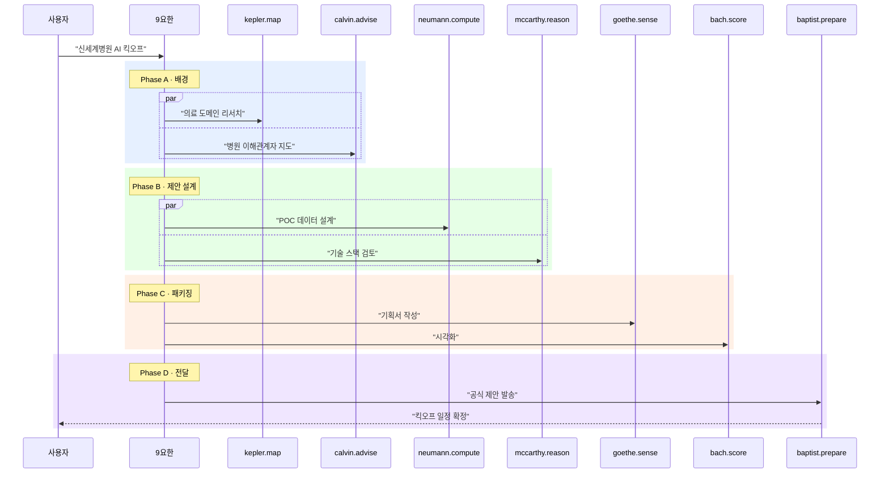

---

## Playbook 10 · 데이터 분석 리포트

### Trigger
"데이터 분석해줘" · "○○ 지표 리포트" · "퍼포먼스 측정"

### 9요한 Routing Decision
```json
{
  "intent": "데이터 분석 리포트",
  "routing": "sequential",
  "agents": ["neumann.compute", "kepler.map", "goethe.sense", "bach.score"],
  "reasoning": "엄밀 분석(노이만) → 법칙 해석(케플러) → 서술(괴테) → 시각화(바흐)"
}
```

### Flow
1. **neumann.compute**: EDA → 가설 검증 → 신뢰구간·한계 명시
2. **kepler.map**: 결과를 일반 법칙·패턴으로 승격
3. **goethe.sense**: 비전공자 대상 서술 (Executive Summary)
4. **bach.score**: 대시보드·차트·인포그래픽
5. **9요한**: 최종 사인오프

### Sequence Diagram
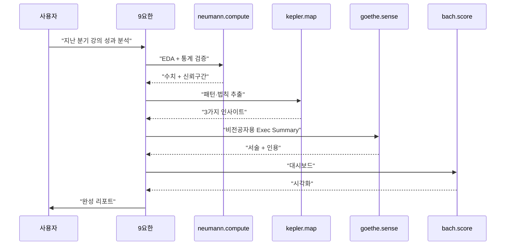

---

## 🎯 Playbook 사용 규칙

### 선택 흐름
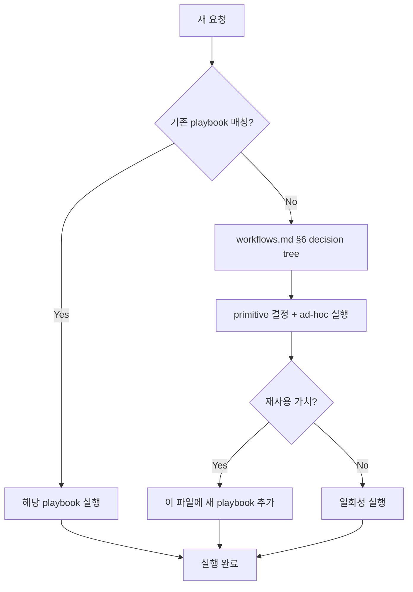

### Playbook 추가 규칙
새 시나리오가 3회 이상 반복되면 여기에 추가:
- Trigger 문구
- Routing Decision JSON
- Flow (단계별)
- Sequence Diagram (mermaid)

---

## 🔗 관련

- [[canonical]] · 정본
- [[constellation]] · 에이전트 정의
- [[workflows]] · 워크플로우 패턴
- [[schemas]] · 메시지 스키마
- [[architecture]] · 하네스
