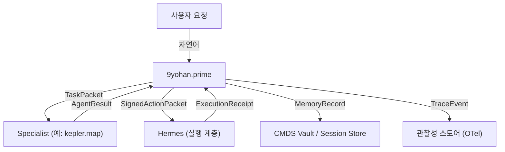

# 9요한 Message Schemas · 메시지 규격

> 9요한과 스페셜리스트 간, 그리고 Hermes 실행 계층과의 모든 메시지는 아래 스키마를 따른다.
> ChatGPT 제안(Task Packet · Agent Result · Signed Action Packet) 기반 · 프로덕션 적용을 위한 최소 필수 구조.
>
> 관련: [[workflows]] (사용 맥락) · [[playbooks]] (실전 페이로드 예시) · [[architecture]] (시스템 컨텍스트)

---

## 1. 스키마 전체 관계도



---

## 2. Task Packet · 9요한 → Specialist

### 2.1 용도
9요한이 스페셜리스트에게 작업을 위임할 때 사용하는 표준 메시지.

### 2.2 스키마 (YAML)

```yaml
task_packet:
  # --- 식별 ---
  task_id: string              # uuid 또는 "task_YYYYMMDD_NNN"
  parent_task_id: string|null  # 상위 task (control loop 체인)
  idempotency_key: string      # 재시도 중복 방지 · 외부 action 있을 때 필수
  trace_id: string             # W3C Trace Context traceparent

  # --- 라우팅 ---
  from: "9yohan.prime"
  to: string                   # 예: "kepler.map"
  return_to: string            # 기본 "9yohan.prime"
  allow_direct_link: boolean   # mesh 모드 허용 여부 (기본 false)

  # --- 의도 ---
  intent: string               # 1줄 요약
  mission: string              # 2-3줄 상세
  success_criteria:
    - string                   # 명시적 성공 조건
  constraints:
    time_budget_min: number    # 분 단위
    cost_ceiling_usd: number|null
    tone: string|null          # 예: "사랑 톤" · "칼뱅 충성" 
    output_format: string      # 예: "markdown" · "yaml" · "image"

  # --- 컨텍스트 ---
  context:
    files: [string]            # 관련 wikilink 또는 절대경로
    previous_results: [object] # 순차 체인에서 이전 단계 결과
    history_summary: string    # 대화 축약
    memory_refs: [string]      # 볼트 참조

  # --- CMDS ---
  cmds_stage: string           # connect|merge|develop|share
  division: string             # 예: "901" 
  fruit_context: string|null   # 예: "온유" (페르소나 강화용)

  # --- 의존성 ---
  depends_on: [string]         # 선행 task_id 목록 (순차 체인)
  
  # --- 메타 ---
  created_at: iso8601_datetime
  deadline: iso8601_datetime|null
  priority: "low"|"normal"|"high"|"critical"
```

### 2.3 예시 (케플러 요한 호출)

```yaml
task_packet:
  task_id: "task_20260419_001"
  parent_task_id: null
  idempotency_key: "idem_20260419_kep_001"
  trace_id: "00-0af7651916cd43dd8448eb211c80319c-b7ad6b7169203331-01"

  from: "9yohan.prime"
  to: "kepler.map"
  return_to: "9yohan.prime"
  allow_direct_link: false

  intent: "LG AX 관련 볼트 리서치"
  mission: "볼트+LLM Wiki+qmd에서 LG AX Camp 프로젝트 관련 기존 자료를 발굴하고 클러스터링"
  success_criteria:
    - "관련 노트 10편 이상 발굴"
    - "3개 이상의 주제 클러스터로 분류"
    - "모든 발굴에 wikilink 출처 포함"
  constraints:
    time_budget_min: 20
    cost_ceiling_usd: null
    tone: "온유 · 겸손한 관찰자"
    output_format: "markdown with wikilinks"

  context:
    files:
      - "[[70. Outputs/75. Consulting/LG-AX-임원교육-프로젝트]]"
    previous_results: []
    history_summary: "사용자가 LG 인화원 후속 제안 준비 중"
    memory_refs: ["session_lg_ax_camp"]

  cmds_stage: "connect"
  division: "901"
  fruit_context: "온유"

  depends_on: []
  created_at: "2026-04-19T16:00:00+09:00"
  deadline: "2026-04-19T16:30:00+09:00"
  priority: "high"
```

---

## 3. Agent Result · Specialist → 9요한

### 3.1 용도
스페셜리스트가 작업을 마치고 9요한에게 결과를 반환할 때 사용.

### 3.2 스키마 (YAML)

```yaml
agent_result:
  # --- 식별 ---
  task_id: string              # Task Packet의 task_id와 매칭
  run_id: string               # 이 실행 고유
  agent: string                # 예: "kepler.map"
  trace_id: string

  # --- 상태 ---
  status: "draft"|"verified"|"blocked"|"failed"
  blocked_reason: string|null  # status=blocked일 때 사유

  # --- 결과 ---
  summary: string              # 1-3줄 Executive summary
  findings:
    - string                   # 핵심 발견 bullet
  artifacts:
    - type: string             # markdown|image|code|data|wikilink
      ref: string              # 경로 또는 wikilink
      description: string
  
  # --- 투명성 ---
  assumptions: [string]        # 작업 중 가정한 것
  limitations: [string]        # 한계·부족
  confidence: number           # 0.0 ~ 1.0
  risks:
    - description: string
      severity: "low"|"medium"|"high"

  # --- 후속 ---
  next_handoff: string|null    # 제안 handoff target agent
  requires_approval: boolean   # 9요한 사인오프 필요 여부

  # --- 페르소나 준수 ---
  persona_adherence:
    fruit_reflected: string    # 어떤 열매 속성이 결과에 반영되었나
    self_check: string         # 간단한 자기 평가

  # --- 메타 ---
  latency_ms: number
  tokens_used: number
  completed_at: iso8601_datetime
  memory_writeback:
    namespace: string          # 예: "connect" · "merge"
    key: string|null
    persist: boolean           # vault에 영구 저장 요청 여부
```

### 3.3 예시 (케플러 응답)

```yaml
agent_result:
  task_id: "task_20260419_001"
  run_id: "run_kep_20260419_001"
  agent: "kepler.map"
  trace_id: "00-0af7651916cd43dd8448eb211c80319c-b7ad6b7169203331-01"

  status: "verified"
  summary: "LG AX Camp 관련 볼트 자료 23편 발굴. 3개 클러스터(임원교육·1on1코칭·CEO교육)로 분류. 다만 최근 3주 자료는 부족."
  findings:
    - "LG-AX-임원교육-프로젝트 폴더에 23편 기 존재"
    - "1on1 코칭은 5명(김영락·백승태·박형세·윤태봉·정수헌)에 대한 결과 기록 있음"
    - "CEO 4시간 커리큘럼은 v3.1까지 버전관리 중"
  artifacts:
    - type: "markdown"
      ref: "agents/kepler/2026-04-19-lg-ax-research-map.md"
      description: "클러스터링 결과 + 각 노트 wikilink"
    - type: "wikilink"
      ref: "[[70. Outputs/75. Consulting/LG-AX-임원교육-프로젝트/README]]"
      description: "프로젝트 전체 개요"

  assumptions:
    - "사용자의 관심 대상은 LG전자 계열 (LG CNS/이노텍은 별도)"
  limitations:
    - "2026-04 이후 신규 자료 없음 확인"
  confidence: 0.85
  risks: []

  next_handoff: "goethe.sense"
  requires_approval: false

  persona_adherence:
    fruit_reflected: "온유 · 자료 부족 부분을 숨기지 않고 명시"
    self_check: "모든 주장에 wikilink 출처 연결 확인"

  latency_ms: 18420
  tokens_used: 12300
  completed_at: "2026-04-19T16:18:00+09:00"
  memory_writeback:
    namespace: "connect"
    key: "lg_ax_camp_research_map"
    persist: false
```

---

## 4. Signed Action Packet · 9요한 → Hermes

### 4.1 용도
외부 action(이메일 발송 · 파일 퍼블리시 · 배포 · 결제 등)을 실행할 때 사용.
**반드시 9요한이 서명**해야 실행 가능. Hermes는 실행만 담당.

### 4.2 스키마 (YAML)

```yaml
signed_action_packet:
  # --- 식별 ---
  packet_id: string
  task_id: string              # 유래 task
  idempotency_key: string      # 재실행 방지

  # --- 서명 ---
  signed_by: "9yohan.prime"    # 필수 · 주권 커널만 서명
  signed_at: iso8601_datetime
  approved_by:                 # 보조 승인자 (선택적)
    - string                   # 예: ["calvin.advise"]
  
  # --- 액션 정의 ---
  action_type: string          # email|publish|schedule|deploy|message|file_write
  target:
    service: string            # 예: "gmail" · "slack" · "vercel" · "notion"
    endpoint: string|null      # 구체 대상
    recipient: string|null     # 수신자
  
  payload:
    # action_type별 다름 (예: email이면 to/subject/body)
    content: object
  
  # --- 안전장치 ---
  rollback_plan: string        # 실패 시 복구 절차
  requires_user_confirm: boolean # 사용자 최종 확인 필요 여부
  dry_run: boolean             # true면 실제 실행 안 함, 시뮬레이션만
  
  # --- 정책 ---
  policy_checks_passed:
    - "pii_redaction"          # 개인정보 마스킹 확인
    - "tool_policy"            # 도구 정책 통과
    - "fruit_alignment"        # 페르소나 일관성
  
  # --- 감사 ---
  audit_tags: [string]
  trace_id: string
```

### 4.3 예시 (이메일 발송)

```yaml
signed_action_packet:
  packet_id: "pkt_20260419_0042"
  task_id: "task_20260419_015"
  idempotency_key: "idem_email_lg_propose_001"

  signed_by: "9yohan.prime"
  signed_at: "2026-04-19T17:00:00+09:00"
  approved_by:
    - "calvin.advise"

  action_type: "email"
  target:
    service: "gmail"
    endpoint: "smtp"
    recipient: "partner@lg.com"

  payload:
    content:
      subject: "[커맨드스페이스] LG AX Camp Part 3 제안"
      body: |
        안녕하세요 ○○님,

        지난 미팅에서 논의한 Part 3 구성안을 송부드립니다.
        첨부: LG-AX-Camp-Part3-제안서.pdf (3.2MB)

        검토 후 편하신 시간 알려주시면 감사하겠습니다.

        구요한 드림
      attachments:
        - "LG-AX-Camp-Part3-제안서.pdf"

  rollback_plan: "발송 후 5분 내에는 Gmail 실행 취소 가능. 이후 정정 메일 발송."
  requires_user_confirm: true
  dry_run: false

  policy_checks_passed:
    - "pii_redaction"
    - "tool_policy"
    - "fruit_alignment"

  audit_tags: ["consulting", "lg_ax", "outbound_email"]
  trace_id: "00-0af7651916cd43dd8448eb211c80319c-b7ad6b7169203331-01"
```

---

## 5. Session Record · 대화/작업 컨텍스트

### 5.1 용도
9요한이 유지하는 세션 단위 컨텍스트. Layer 1 Session Context 저장소 ([[workflows]] §8).

### 5.2 스키마

```yaml
session_record:
  session_key: string          # 예: "session_lg_ax_camp"
  parent_session_id: string|null
  
  user: "[[구요한]]"
  started_at: iso8601_datetime
  last_active_at: iso8601_datetime
  
  # --- 대화 ---
  turns:
    - turn_id: number
      at: iso8601_datetime
      role: "user"|"9yohan"|"specialist"
      agent: string|null       # specialist인 경우
      content: string
      artifacts: [object]
  
  # --- 라우팅 이력 ---
  routing_history:
    - task_id: string
      routing: "single"|"sequential"|"parallel"|"control_loop"
      agents: [string]
      at: iso8601_datetime
      outcome: "success"|"failed"|"aborted"
  
  # --- 작업 메모 ---
  working_memory:
    active_topic: string
    pending_decisions: [string]
    scratch_notes: [string]
  
  # --- 상태 ---
  status: "active"|"paused"|"completed"|"archived"
```

---

## 6. Memory Writeback Record · Vault 영구 저장

### 6.1 용도
Session/Scratch에서 Vault로 승격할 때 사용. Layer 2 → Layer 3 전환.

### 6.2 스키마

```yaml
memory_writeback:
  source:
    task_id: string
    agent: string
    session_key: string
  
  target:
    # Obsidian wikilink 또는 물리 경로
    vault_path: string         # 예: "30. Permanent Notes/..."
    cmds_category: string      # 예: "[[📚 901 Knowledge Management & Research Division]]"
    cmds_subcategory: string   # 예: "901.02 LLM Wiki"
  
  content:
    type: string               # note|terminology|manuscript|research-pipeline 등
    title: string
    body: string               # markdown
    frontmatter:
      type: string
      aliases: [string]
      description: string      # English · LLM hint
      tags: [string]
      # ... 기타 CMDS 표준 필드
  
  signed_by: "9yohan.prime"
  at: iso8601_datetime
```

---

## 7. Trace Event · 관찰성

### 7.1 용도
분산 추적 · 디버깅 · 성능 분석. OpenTelemetry 호환.

### 7.2 스키마 (CloudEvents 기반)

```yaml
trace_event:
  # CloudEvents 1.0
  specversion: "1.0"
  type: string                 # 예: "9yohan.task.dispatched" · "specialist.completed"
  source: string               # 예: "9yohan.prime" · "kepler.map"
  id: string                   # event ID
  time: iso8601_datetime
  subject: string              # 예: "session/<key>/task/<id>"
  datacontenttype: "application/json"
  
  # W3C Trace Context
  traceparent: string
  tracestate: string|null
  
  # --- 이벤트 데이터 ---
  data:
    task_id: string
    agent: string|null
    fruit_context: string|null
    cmds_stage: string|null
    status: string
    latency_ms: number|null
    tokens_used: number|null
    cost_usd: number|null
    error: string|null
```

### 7.3 표준 이벤트 타입

| Type | 발생 시점 |
|------|---------|
| `9yohan.request.received` | 사용자 요청 수신 |
| `9yohan.task.dispatched` | specialist로 task 전송 |
| `specialist.started` | specialist 작업 시작 |
| `specialist.completed` | specialist 결과 반환 |
| `specialist.failed` | specialist 오류 |
| `9yohan.approval.requested` | 외부 action 승인 대기 |
| `9yohan.approval.granted` | 승인 완료 |
| `hermes.action.executed` | Hermes 외부 action 성공 |
| `hermes.action.failed` | Hermes 외부 action 실패 |
| `9yohan.memory.written` | Vault 영구 저장 |

---

## 8. 핵심 불변식 (Invariants)

구현할 때 반드시 지켜야 할 규약.

### 8.1 식별자
- `task_id`: 전체 시스템 내 **unique** · 재사용 금지
- `idempotency_key`: 외부 action 있는 모든 메시지에 **필수** · 같은 키로 2회 이상 실행 시 첫 결과 재사용
- `trace_id`: W3C Trace Context 형식 · 한 사용자 요청 단위로 end-to-end 유지

### 8.2 서명
- `SignedActionPacket`의 `signed_by`는 **반드시** `9yohan.prime`
- 스페셜리스트가 서명한 action packet은 Hermes가 거부
- 서명 없이 외부 action 시도 시 정책 위반으로 로깅

### 8.3 Handoff
- 모든 handoff는 TaskPacket 또는 AgentResult 중 하나
- `return_to`가 `9yohan.prime`이 아닌 경우 `allow_direct_link=true` 선행 필수
- 순환 handoff(A→B→A) 탐지 시 자동 중단

### 8.4 페르소나 준수
- 모든 AgentResult는 `persona_adherence.fruit_reflected` 채워져야 함
- 해당 요한의 Fruit과 일치하지 않는 결과는 9요한이 반려 가능

---

## 9. 구현 힌트

### 9.1 저장 레이어
- **TaskPacket / AgentResult**: 세션 DB (예: SQLite · [[constellation]] 참조)
- **SignedActionPacket**: 영구 원장(append-only ledger) · 감사 목적
- **SessionRecord**: FTS5 인덱스 포함 SQLite
- **TraceEvent**: OpenTelemetry Collector → 스토리지

### 9.2 검증 방법
- 스키마 검증: JSON Schema · TypeBox · Zod 중 택일
- 런타임에서 모든 메시지 검증 (들어올 때도, 나갈 때도)
- 검증 실패 시 `status: blocked` + `blocked_reason` 기록

### 9.3 예시 코드 구조 (TypeScript 아이디어)

```typescript
interface TaskPacket {
  task_id: string;
  idempotency_key: string;
  trace_id: string;
  from: "9yohan.prime";
  to: AgentHandle;
  intent: string;
  mission: string;
  success_criteria: string[];
  // ... 
}

interface AgentResult {
  task_id: string;
  run_id: string;
  agent: AgentHandle;
  status: "draft" | "verified" | "blocked" | "failed";
  confidence: number;
  persona_adherence: {
    fruit_reflected: Fruit;
    self_check: string;
  };
  // ...
}

type AgentHandle =
  | "9yohan.prime"
  | "kepler.map"
  | "goethe.sense"
  | "dewey.learn"
  | "bach.score"
  | "neumann.compute"
  | "baptist.prepare"
  | "mccarthy.reason"
  | "huizinga.play"
  | "calvin.advise";

type Fruit = "사랑" | "희락" | "화평" | "오래 참음" | "자비" | "양선" | "충성" | "온유" | "절제";
```

---

## 🔗 관련

- [[canonical]] · 정본
- [[constellation]] · 에이전트 정의
- [[workflows]] · 워크플로우 패턴
- [[playbooks]] · 실전 시나리오
- [[architecture]] · 하네스 기술 스펙
