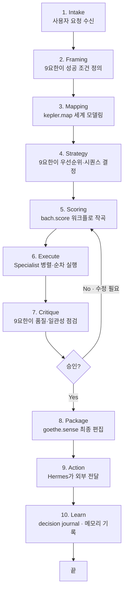
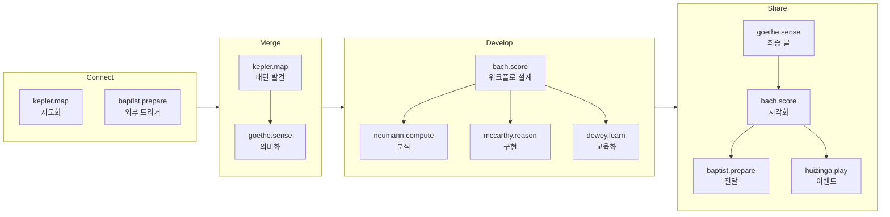
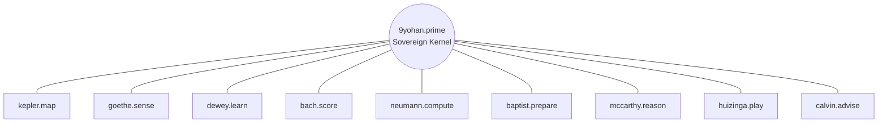
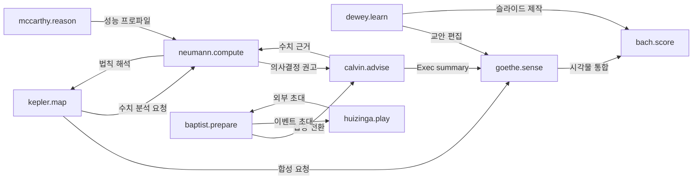
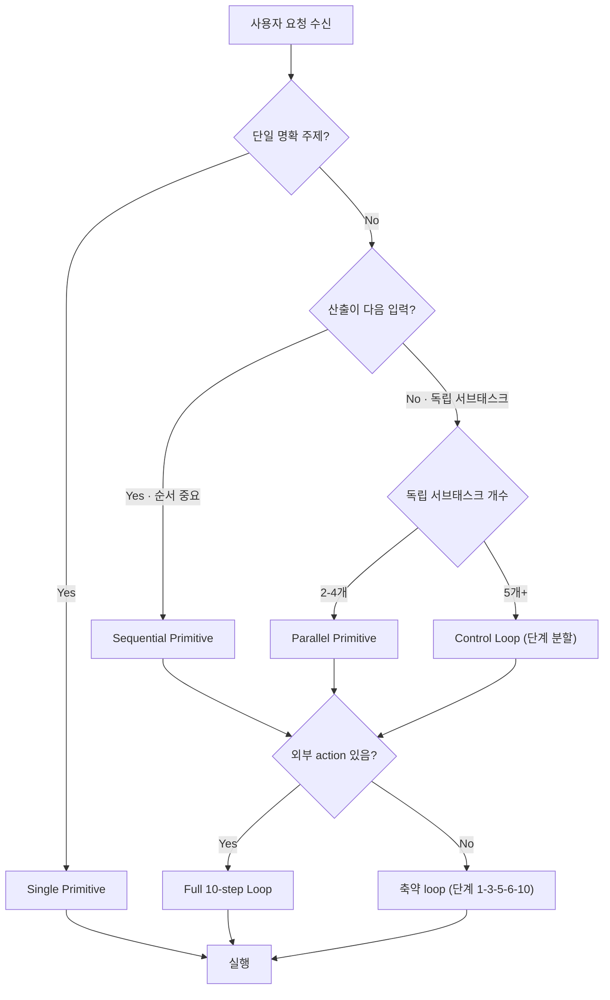
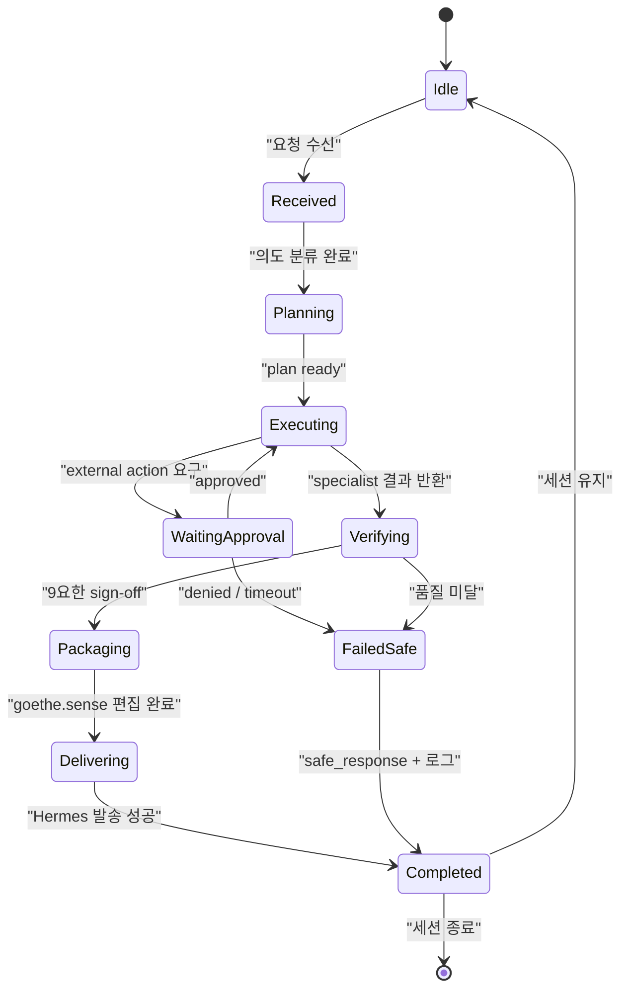
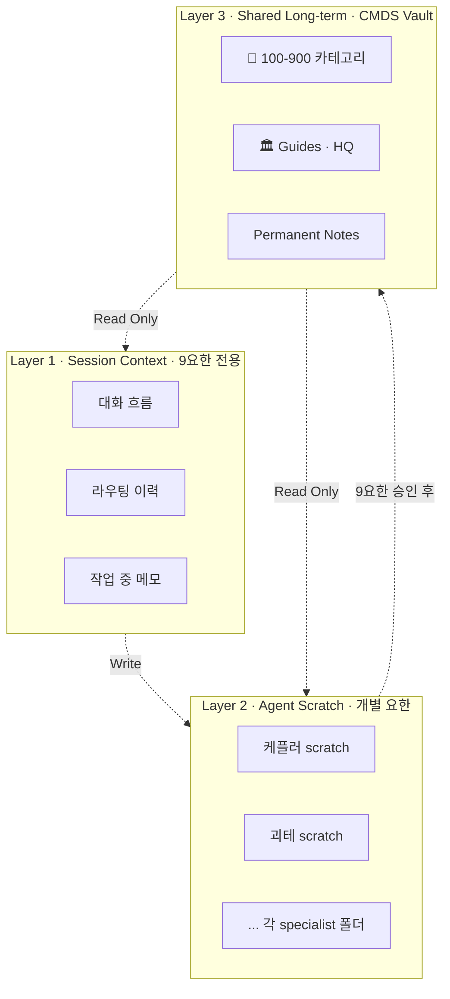

# 9요한 Workflows · 작업 설계

> 9요한 Constellation이 실제로 **어떻게 협업하여 일을 진행하는가**에 대한 운영 설계.
> ChatGPT 제안(Sovereign Kernel + Control Loop), Gemini 제안(Persona Injector + Event Bus), grok 제안(LangGraph StateGraph)을 종합하여 최소·실용 워크플로우로 정제.
>
> 정본: [[canonical]] · 에이전트 정의: [[constellation]] · 시나리오: [[playbooks]] · 메시지 규격: [[schemas]]

---

## 1. 네 가지 Workflow Primitive

모든 작업은 아래 4개 패턴 중 하나의 조합.

| Primitive | 정의 | 예시 |
|-----------|------|------|
| **Single** | 9요한 → 1인 specialist → 반환 | "오늘 미팅 노트 정리" → 케플러 단독 |
| **Sequential** | 9요한이 N명 specialist를 순차 연결 (A 산출이 B 입력) | "강의 커리큘럼" → 케플러 → 듀이 → 괴테 |
| **Parallel** | 9요한이 여러 specialist를 동시 호출, 마지막에 합성 | "제안서" → [칼뱅 ∥ 노이만 ∥ 케플러] → 괴테 |
| **Control Loop** | Plan-Execute-Verify 피드백 순환 (복합·승인 필요 작업) | "LG-AX Camp 기획" → 10-step loop |

9요한이 입력을 보고 어느 primitive를 쓸지 결정한다 (→ §2).

---

## 2. The 10-Step Control Loop

복합 작업의 표준 사이클. ChatGPT 제안 기반 · 실용적으로 축약.

**언제 full loop을 쓰는가**: 외부 action(고객 발송·퍼블리시·계약)이 있거나, 3인 이상 specialist가 관여하는 복합 작업.
**언제 생략하는가**: Single / 단순 Sequential은 1~3-5-6-10만 돌아도 충분.

---

## 3. CMDS Process × 9요한 매핑

Connect → Merge → Develop → Share의 각 단계에서 **Lead(주도) / Support(보조)** 역할.

### 3.1 매핑 매트릭스

| CMDS Stage | Lead | Primary Support | Secondary | 대표 산출물 |
|-----------|------|-----------------|-----------|---------|
| 🔗 **Connect** | `kepler.map` (901) | `baptist.prepare` (906) | `huizinga.play` (908) | theme graph · opportunity map · inbox triage |
| 🔀 **Merge** | `kepler.map` (901) → `goethe.sense` (902) | `neumann.compute` (905) | `calvin.advise` (909) | synthesis memo · literature weave · concept frame |
| 🛠 **Develop** | `bach.score` (904) | `mccarthy.reason` (907) · `neumann.compute` (905) | `dewey.learn` (903) | workflow · prototype · curriculum · code |
| 📤 **Share** | `goethe.sense` (902) → `bach.score` (904) | `baptist.prepare` (906) · `huizinga.play` (908) | `calvin.advise` (909) | newsletter · deck · event · release |

### 3.2 Stage Routing 다이어그램

---

## 4. Star Topology · 통신 구조

기본은 **star**, 예외적으로 **mesh** 허용.

### 4.1 Star (기본값)

**의미**: 모든 메시지는 9요한을 경유. 각 specialist는 동급(peer) · 직접 호출 금지.

### 4.2 Mesh (예외)

9요한이 `allow_direct_link=true` 플래그를 부여한 경우에만 specialist ↔ specialist 직결 가능. 예시:

- `kepler.map` → `goethe.sense`: 대량 리서치 합성 시 지연 단축
- `neumann.compute` → `bach.score`: 데이터 시각화 순차 체인
- `baptist.prepare` ↔ `huizinga.play`: 이벤트 초대장 공동 작성

---

## 5. 핸드오프 규약 (Handoff Contract)

### 5.1 규칙

1. 핸드오프 메시지는 반드시 [[schemas|Task Packet 스키마]]를 따름
2. 모든 handoff는 `from` · `to` · `intent` · `context` · `depends_on` · `return_to` 필드 필수
3. `return_to`는 기본값 `9yohan.prime` (mesh 모드에서만 다른 specialist 가능)
4. 각 specialist는 자기 Output Contract ([[constellation]] 정의)를 지킨 결과만 반환

### 5.2 전형적 Handoff 패턴

### 5.3 Handoff Preconditions

| From → To | 전제 조건 |
|----------|---------|
| `kepler.map` → `goethe.sense` | 출처 wikilink 포함, confidence marker 명시 |
| `goethe.sense` → `bach.score` | 초안 완성 + 채널 포맷 메타데이터 |
| `dewey.learn` → `bach.score` | 학습목표 · 사전지식 정의 완료 |
| `neumann.compute` → `calvin.advise` | 신뢰구간 · 한계 명시 |
| `baptist.prepare` → `calvin.advise` | 이해관계자 맥락 · 과거 대화 요약 |
| `any` → `9yohan.prime` | 전체 산출물 + confidence + risks |

---

## 6. 실행 패턴별 Decision Tree

9요한이 입력을 받았을 때의 판단 흐름:

---

## 7. State Machine · 작업 상태 전이

한 task의 수명 주기:

---

## 8. 메모리 아키텍처 · 어디에 무엇을 쓰는가

**쓰기 권한 규칙**:
- **L1 (Session)**: 9요한만 R/W
- **L2 (Agent Scratch)**: 해당 specialist만 R/W · 경로: `00. Inbox/03. AI Agent/agents/{handle}/`
- **L3 (Vault)**: 모두 R · 9요한 승인 후에만 W (일관성 보장)

---

## 9. 관찰성 · 매 단계 추적 필드

모든 작업은 아래 필드로 추적 가능해야 함 (W3C Trace Context + 사용자 고유 필드).

| 필드 | 예시 | 용도 |
|------|------|------|
| `task_id` | `task_20260419_001` | 최상위 작업 ID |
| `trace_id` | `00-0af7-...` (W3C) | 분산 추적 |
| `run_id` | `run_001_kepler` | specialist별 실행 단위 |
| `idempotency_key` | `idem_20260419_0001` | 외부 action 중복 방지 |
| `session_key` | `session_lg_ax_camp` | 관련 작업 묶음 |
| `cmds_stage` | `merge` | CMDS Process 위치 |
| `fruit_invoked` | `사랑 · 온유` | 품질 게이트 시 참조 |

---

## 10. Control Loop 관여 요한 빠른 참조표

어떤 단계에 어떤 요한이 기본 관여하는가:

| Step | 기본 담당 요한 | 이유 |
|------|---------|------|
| 1 Intake | 9yohan | 주권 |
| 2 Framing | 9yohan | 성공 조건은 주권이 정의 |
| 3 Mapping | **kepler.map** | 세계 모델링의 권위 |
| 4 Strategy | 9yohan (+ 선택적 calvin.advise) | 전략 판단 |
| 5 Scoring | **bach.score** | 워크플로 작곡 |
| 6 Execute | 선택된 specialists | 전문성 |
| 7 Critique | 9yohan (+ 향후 brahms.review) | 품질 판단 |
| 8 Package | **goethe.sense** (+ bach.score) | 최종 편집·시각 |
| 9 Action | **Hermes** (외부 실행 계층) | 실행 권한 집중 |
| 10 Learn | 9yohan → Vault write | 지식 자산화 |

---

## 11. 금지 · 안티 패턴

9요한 시스템이 **절대 하지 말아야 할** 것들.

1. ❌ Specialist가 9요한 승인 없이 외부 action 실행
2. ❌ Specialist가 다른 specialist를 직접 호출 (mesh flag 없이)
3. ❌ 9요한이 직접 전문 작업 수행 (위임 없이)
4. ❌ 동시에 5명 이상 specialist 활성화 (인지 부하)
5. ❌ 같은 input으로 non-deterministic recursion (self-loop)
6. ❌ Session 메모리에 PII/비밀 평문 저장
7. ❌ Task Packet 스키마 없이 ad-hoc 메시지 전달

---

## 🔗 관련

- [[canonical]] · 정본 (이름·Fruit·근거)
- [[constellation]] · 에이전트 운영 정의 (system prompt·도구)
- [[architecture]] · 하네스 기술 스펙
- [[playbooks]] · 구체 시나리오 10+
- [[schemas]] · 메시지 규격
- [[요한쓰]] · 선정 리서치 · 대안 아카이브
