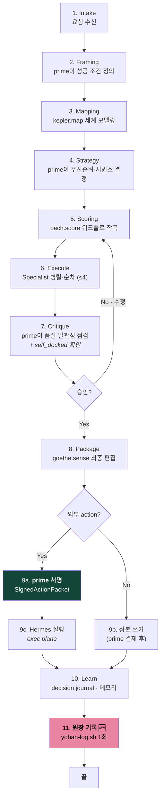
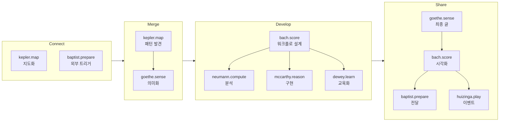
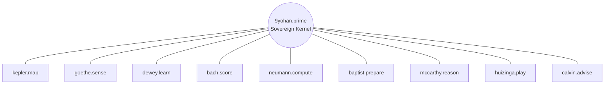
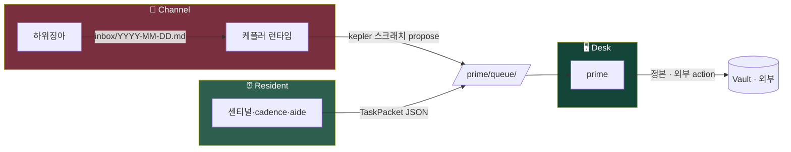
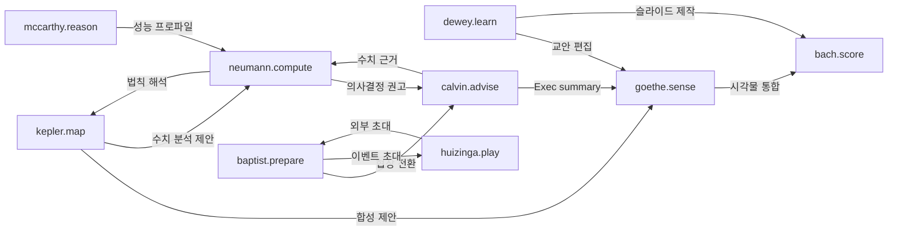
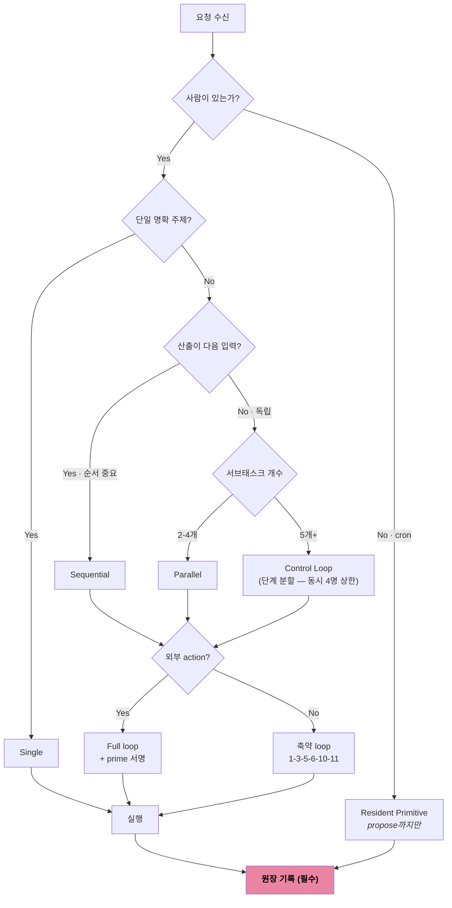
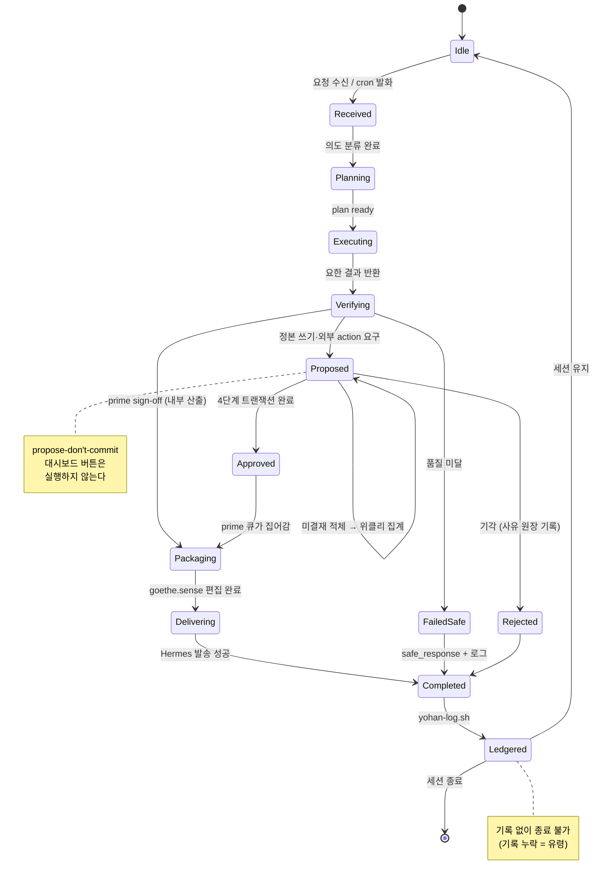
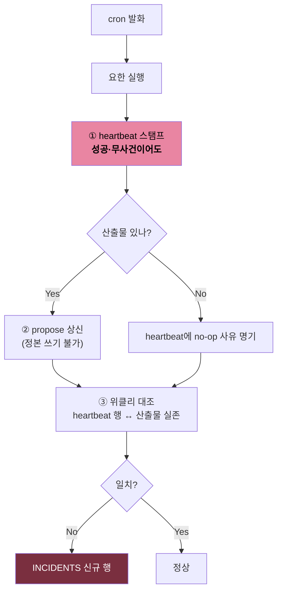
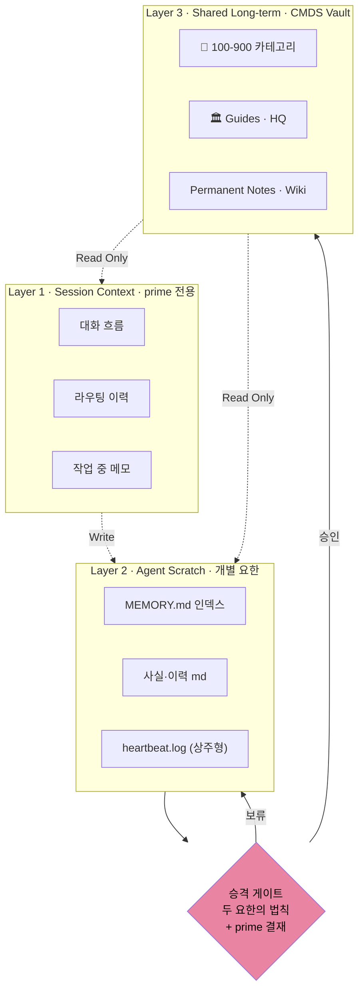

# 9요한 Workflows · 작업 설계

> 9요한 Constellation이 실제로 **어떻게 협업하여 일을 진행하는가**.
> 정본: [[canonical]] · 기술 스펙: [[architecture]] · 에이전트 정의: [[constellation]] · 시나리오: [[playbooks]] · 메시지 규격: [[schemas]]
> **2026-08-24 개정**: 무인 상주 primitive 추가 · Control Loop에 원장 기록·결재 트랜잭션 반영 · 핸드오프를 3-plane 경계 기준으로 재정의.

---

## 1. 다섯 가지 Workflow Primitive

모든 작업은 아래 5개 패턴 중 하나의 조합.

| Primitive | 정의 | 평면 | 예시 |
|-----------|------|---|------|
| **Single** | prime → 1인 → 반환 | Desk | "오늘 미팅 노트 정리" → 케플러 단독 |
| **Sequential** | N명 순차 연결 (A 산출이 B 입력) | Desk | "강의 커리큘럼" → 케플러 → 듀이 → 괴테 |
| **Parallel** | 동시 호출 후 합성 (**≤4**) | Desk | "제안서" → [칼뱅 ∥ 노이만 ∥ 케플러] → 괴테 |
| **Control Loop** | Plan-Execute-Verify 순환 | Desk | 외부 action 있는 복합 작업 |
| **Resident** 🆕 | cron이 깨움 · 사람 없음 · **propose까지만** | Resident | kepler-sentinel · baptist-cadence · aide-heartbeat |

앞의 넷은 prime이 입력을 보고 고른다 (→ §6 결정 트리). **Resident는 prime이 고르지 않는다** — 스케줄이 고른다. 그래서 규율이 다르다 (→ §8).

---

## 2. The 10-Step Control Loop

복합 작업의 표준 사이클.

```mermaid
flowchart TD
    A["1. Intake<br/>요청 수신"] --> B["2. Framing<br/>prime이 성공 조건 정의"]
    B --> C["3. Mapping<br/>kepler.map 세계 모델링"]
    C --> D["4. Strategy<br/>prime이 우선순위·시퀀스 결정"]
    D --> E["5. Scoring<br/>bach.score 워크플로 작곡"]
    E --> F["6. Execute<br/>Specialist 병렬·순차 (≤4)"]
    F --> G["7. Critique<br/>prime이 품질·일관성 점검<br/><i>+ self_docked 확인</i>"]
    G --> H{"승인?"}
    H -->|"No · 수정"| E
    H -->|"Yes"| I["8. Package<br/>goethe.sense 최종 편집"]
    I --> J{"외부 action?"}
    J -->|"Yes"| K["9a. <b>prime 서명</b><br/>SignedActionPacket"]
    J -->|"No"| L["9b. 정본 쓰기<br/>(prime 결재 후)"]
    K --> M["9c. Hermes 실행<br/><i>exec plane</i>"]
    M --> N
    L --> N["10. Learn<br/>decision journal · 메모리"]
    N --> O["11. <b>원장 기록</b> 🆕<br/>yohan-log.sh 1회"]
    O --> P["끝"]

    style K fill:#134538,color:#fff
    style O fill:#E985A2,color:#000
```

### 2.1 8월 개정 3건

| # | 4월 판본 | 현행 | 왜 |
|---|---|---|---|
| ① | 9단계 "Hermes가 외부 전달" | **9a prime 서명 → 9c Hermes 실행**으로 분리 | 실행 권한과 서명 권한은 다른 것. Hermes는 exec plane이지 결정권자가 아니다 |
| ② | 10단계에서 종료 | **11단계 원장 기록 추가** | 기록 없는 런 = 유령. 런 종료 즉시 1회 ([[9YOHAN-CONTROL-PLANE]] §4) |
| ③ | 7단계 품질 점검 | **`self_docked` 확인 포함** | 스스로 기각한 주장이 없는 산출은 검증이 얕았다는 신호 |

**언제 full loop인가**: 외부 action(고객 발송·퍼블리시·계약)이 있거나 3인 이상 관여.
**언제 생략하는가**: Single/단순 Sequential은 `1-3-5-6-10-11`. **11은 절대 생략 불가.**

---

## 3. CMDS Process × 9요한 매핑

### 3.1 매핑 매트릭스

| CMDS Stage | Lead | Primary Support | Secondary | 대표 산출물 |
|-----------|------|-----------------|-----------|---------|
| 🔗 **Connect** | `kepler.map` (901) | `baptist.prepare` (906) | `huizinga.play` (908) | theme graph · opportunity map · inbox triage |
| 🔀 **Merge** | `kepler.map` (901) → `goethe.sense` (902) | `neumann.compute` (905) | `calvin.advise` (909) | synthesis memo · literature weave · concept frame |
| 🛠 **Develop** | `bach.score` (904) | `mccarthy.reason` (907) · `neumann.compute` (905) | `dewey.learn` (903) | workflow · prototype · curriculum · code |
| 📤 **Share** | `goethe.sense` (902) → `bach.score` (904) | `baptist.prepare` (906) · `huizinga.play` (908) | `calvin.advise` (909) | newsletter · deck · event · release |

### 3.2 Stage Routing

```mermaid
flowchart LR
    subgraph Connect
        direction TB
        K1["kepler.map<br/>지도화"]
        BP1["baptist.prepare<br/>외부 트리거"]
    end
    subgraph Merge
        direction TB
        K2["kepler.map<br/>패턴 발견"]
        G1["goethe.sense<br/>의미화"]
        K2 --> G1
    end
    subgraph Develop
        direction TB
        B1["bach.score<br/>워크플로 설계"]
        N1["neumann.compute<br/>분석"]
        MC1["mccarthy.reason<br/>구현"]
        DE1["dewey.learn<br/>교육화"]
        B1 --> N1
        B1 --> MC1
        B1 --> DE1
    end
    subgraph Share
        direction TB
        G2["goethe.sense<br/>최종 글"]
        B2["bach.score<br/>시각화"]
        BP2["baptist.prepare<br/>전달"]
        HU1["huizinga.play<br/>이벤트"]
        G2 --> B2
        B2 --> BP2
        B2 --> HU1
    end
    Connect --> Merge --> Develop --> Share
```

---

## 4. 통신 구조 — 평면 안 star, 평면 사이 파일

### 4.1 Desk 평면 내부 (star)

```mermaid
flowchart TD
    Y9(("9yohan.prime<br/>Sovereign Kernel"))
    Y9 --- K["kepler.map"]
    Y9 --- GO["goethe.sense"]
    Y9 --- DE["dewey.learn"]
    Y9 --- BA["bach.score"]
    Y9 --- NE["neumann.compute"]
    Y9 --- BAP["baptist.prepare"]
    Y9 --- MC["mccarthy.reason"]
    Y9 --- HU["huizinga.play"]
    Y9 --- CA["calvin.advise"]
```

모든 메시지는 prime을 경유. 각 요한은 동급(peer) · **직접 소환 금지.**

### 4.2 평면 경계 (파일)

```mermaid
flowchart LR
    subgraph CH["💬 Channel"]
        H["하위징아"] -->|"inbox/YYYY-MM-DD.md"| KR["케플러 런타임"]
    end
    subgraph RS["⏰ Resident"]
        S["센티널·cadence·aide"]
    end
    subgraph DK["🖥 Desk"]
        P["prime"]
    end
    KR -->|"kepler 스크래치 propose"| Q
    S -->|"TaskPacket JSON"| Q[/"prime/queue/"/]
    Q --> P
    P -->|"정본 · 외부 action"| V[("Vault · 외부")]

    style CH fill:#7a2f3f,color:#fff
    style RS fill:#2d5f4f,color:#fff
    style DK fill:#134538,color:#fff
```

> **4월의 "mesh 예외"는 폐기됐다.** `allow_direct_link=true`로 요한 간 직결을 허용하려던 설계는 쓰이지 않았고, 8월 배치에서는 위험하다 — 평면이 갈라진 뒤로 "직결"이 곧 경계 침범이 될 수 있다. 핸드오프는 **next action 제안**으로만 한다 (prime이 다음 요한을 부른다).

---

## 5. 핸드오프 규약 (Handoff Contract)

### 5.1 규칙

1. 핸드오프 메시지는 [[schemas|TaskPacket 8필드 축소판]]을 따름
2. `from` · `to` · `intent` · `context` · `depends_on` · `return_to` 필수
3. `return_to`는 **항상** `9yohan.prime`
4. 각 요한은 자기 Output Contract ([[constellation]])를 지킨 결과만 반환
5. 🆕 **요한은 다음 요한을 부르지 않는다** — "다음은 괴테가 맡는 게 좋겠다"를 AgentResult에 **제안**으로 적는다. 호출은 prime이 한다.

### 5.2 전형적 핸드오프 (제안 그래프)

아래 화살표는 **호출**이 아니라 **"이 다음엔 저 요한"이라는 제안 경로**다.

```mermaid
flowchart LR
    K["kepler.map"] -->|"합성 제안"| G["goethe.sense"]
    K -->|"수치 분석 제안"| N["neumann.compute"]
    G -->|"시각물 통합"| B["bach.score"]
    DE["dewey.learn"] -->|"교안 편집"| G
    DE -->|"슬라이드 제작"| B
    N -->|"법칙 해석"| K
    N -->|"의사결정 권고"| CA["calvin.advise"]
    BAP["baptist.prepare"] -->|"협상 전환"| CA
    BAP -->|"이벤트 초대"| HU["huizinga.play"]
    MC["mccarthy.reason"] -->|"성능 프로파일"| N
    CA -->|"수치 근거"| N
    CA -->|"Exec summary"| G
    HU -->|"외부 초대"| BAP
```

### 5.3 Handoff Preconditions

| From → To | 전제 조건 |
|----------|---------|
| `kepler.map` → `goethe.sense` | 출처 wikilink 포함, confidence marker 명시 |
| `goethe.sense` → `bach.score` | 초안 완성 + 채널 포맷 메타데이터 |
| `dewey.learn` → `bach.score` | 학습목표 · 사전지식 정의 완료 |
| `neumann.compute` → `calvin.advise` | 신뢰구간 · 한계 명시 |
| `baptist.prepare` → `calvin.advise` | 이해관계자 맥락 · 과거 대화 요약 |
| `any` → `9yohan.prime` | 산출물 + confidence + risks + **`self_docked`** |

---

## 6. 실행 패턴 결정 트리

```mermaid
flowchart TD
    A["요청 수신"] --> Z{"사람이 있는가?"}
    Z -->|"No · cron"| RES["Resident Primitive<br/><i>propose까지만</i>"]
    Z -->|"Yes"| B{"단일 명확 주제?"}
    B -->|"Yes"| C["Single"]
    B -->|"No"| D{"산출이 다음 입력?"}
    D -->|"Yes · 순서 중요"| E["Sequential"]
    D -->|"No · 독립"| F{"서브태스크 개수"}
    F -->|"2-4개"| G["Parallel"]
    F -->|"5개+"| H["Control Loop<br/>(단계 분할 — 동시 4명 상한)"]
    E --> I{"외부 action?"}
    G --> I
    H --> I
    I -->|"Yes"| J["Full loop<br/>+ prime 서명"]
    I -->|"No"| K["축약 loop<br/>1-3-5-6-10-11"]
    C --> L["실행"]
    J --> L
    K --> L
    L --> M["<b>원장 기록 (필수)</b>"]
    RES --> M

    style M fill:#E985A2,color:#000
```

---

## 7. State Machine · 작업 상태 전이

```mermaid
stateDiagram-v2
    [*] --> Idle
    Idle --> Received: 요청 수신 / cron 발화
    Received --> Planning: 의도 분류 완료
    Planning --> Executing: plan ready
    Executing --> Verifying: 요한 결과 반환
    Verifying --> FailedSafe: 품질 미달
    Verifying --> Proposed: 정본 쓰기·외부 action 요구
    Verifying --> Packaging: prime sign-off (내부 산출)

    Proposed --> Approved: 4단계 트랜잭션 완료
    Proposed --> Rejected: 기각 (사유 원장 기록)
    Proposed --> Proposed: 미결재 적체 → 위클리 집계
    Approved --> Packaging: prime 큐가 집어감

    Packaging --> Delivering: goethe.sense 편집 완료
    Delivering --> Completed: Hermes 발송 성공
    FailedSafe --> Completed: safe_response + 로그
    Rejected --> Completed
    Completed --> Ledgered: yohan-log.sh
    Ledgered --> Idle: 세션 유지
    Ledgered --> [*]: 세션 종료

    note right of Proposed
        propose-don't-commit
        대시보드 버튼은
        실행하지 않는다
    end note
    note right of Ledgered
        기록 없이 종료 불가
        (기록 누락 = 유령)
    end note
```

**4월 판본과의 차이**: `WaitingApproval` 단일 상태가 `Proposed → Approved/Rejected`로 분화했고, 종료 전에 `Ledgered`를 반드시 통과한다.

---

## 8. Resident Primitive · 무인 상주의 규율

사람이 없으므로 **실패가 조용하다.** 그래서 규율이 셋 더 붙는다.

```mermaid
flowchart TD
    C["cron 발화"] --> R["요한 실행"]
    R --> HB["① heartbeat 스탬프<br/><b>성공·무사건이어도</b>"]
    HB --> O{"산출물 있나?"}
    O -->|"Yes"| P["② propose 상신<br/>(정본 쓰기 불가)"]
    O -->|"No"| NOOP["heartbeat에 no-op 사유 명기"]
    P --> W["③ 위클리 대조<br/>heartbeat 행 ↔ 산출물 실존"]
    NOOP --> W
    W --> X{"일치?"}
    X -->|"No"| INC["INCIDENTS 신규 행"]
    X -->|"Yes"| OK["정상"]

    style HB fill:#E985A2,color:#000
    style INC fill:#7a2f3f,color:#fff
```

| 규율 | 내용 | 기원 |
|---|---|---|
| ① **라이브니스 스탬프** | 매 실행 `agents/{handle}/heartbeat.log`에 1행. **부재 ≠ 정상** | INCIDENTS 001·002 |
| ② **propose-don't-commit** | 무인 잡은 정본을 쓰지 않는다. 제안까지 | 불변식 |
| ③ **산출물 실존 대조** | 위클리가 "로그상 done"이 아니라 **파일이 있고 비어있지 않은지** 확인 | 0바이트 벤치 4주 사건 |

**Hermes cron 특례**: `cron_mode=deny` 하에서 에이전트 잡의 파일 쓰기가 제한될 수 있으므로, Hermes cron 잡의 라이브니스 정본은 `hermes cron list`의 **Last run + 배달된 텔레그램 다이제스트 실물**이다. `--script` 잡(aide-heartbeat·baptist-cadence)은 스크립트가 직접 스탬프.

> ⚠️ **배달 성공도 확인해야 한다.** INCIDENTS 003 — Last run은 ok인데 텔레그램 배달이 실패했다 (`deliver=telegram` 타깃 미해석). 규약 제정 **당일** 유령 형상이 재현됐다. 배달 타깃은 명시 chat_id로 고정.

---

## 9. 메모리 아키텍처 · 어디에 무엇을 쓰는가

```mermaid
flowchart TB
    subgraph L1["Layer 1 · Session Context · prime 전용"]
        S1["대화 흐름"]
        S2["라우팅 이력"]
        S3["작업 중 메모"]
    end
    subgraph L2["Layer 2 · Agent Scratch · 개별 요한"]
        A1["MEMORY.md 인덱스"]
        A2["사실·이력 md"]
        A3["heartbeat.log (상주형)"]
    end
    subgraph L3["Layer 3 · Shared Long-term · CMDS Vault"]
        V1["📖 100-900 카테고리"]
        V2["🏛 Guides · HQ"]
        V3["Permanent Notes · Wiki"]
    end
    GATE{"승격 게이트<br/>두 요한의 법칙<br/>+ prime 결재"}

    L1 -.Write.-> L2
    L2 --> GATE
    GATE -->|"승인"| L3
    GATE -->|"보류"| L2
    L3 -.Read Only.-> L1
    L3 -.Read Only.-> L2

    style GATE fill:#E985A2,color:#000
```

| 계층 | 권한 | 경로 |
|---|---|---|
| L1 Session | prime만 R/W | 세션 윈도우 |
| L2 Scratch | 해당 요한만 R/W | `00. Inbox/03. AI Agent/agents/{handle}/` |
| L3 Vault | 전원 R · **prime 결재 후에만 W** | CMDS Vault |

**recall-before-write**: 스크래치에 쓰기 전 중복·모순 확인 grep. **경로를 지정해서** 한다 — 볼트 전수 grep은 컨텍스트를 태운다 ([[architecture]] §3.2 함정).

---

## 10. 관찰성 · 추적 필드

| 필드 | 예시 | 용도 |
|------|------|------|
| `task_id` | `pb01-20260823-kepler` | 최상위 작업 ID |
| `trace_id` | `00-0af7-…` (W3C) | 분산 추적 |
| `run_id` | `run_001_kepler` | 요한별 실행 단위 |
| `idempotency_key` | `idem_20260823_0001` | 외부 action 중복 방지 |
| `session_key` | `session_lg_ax_camp` | 관련 작업 묶음 |
| `cmds_stage` | `merge` | CMDS Process 위치 |
| `fruit_invoked` | `사랑 · 온유` | 품질 게이트 참조 |
| `self_docked` | `["단정 1건 철회"]` | 자진 기각 (신뢰 화폐) |

---

## 11. Control Loop 관여 요한 빠른 참조표

| Step | 담당 | 이유 |
|------|---------|------|
| 1 Intake | prime | 주권 |
| 2 Framing | prime | 성공 조건은 주권이 정의 |
| 3 Mapping | **kepler.map** | 세계 모델링의 권위 |
| 4 Strategy | prime (+선택적 calvin.advise) | 전략 판단 |
| 5 Scoring | **bach.score** | 워크플로 작곡 |
| 6 Execute | 선택된 요한들 (≤4) | 전문성 |
| 7 Critique | prime | 품질 판단 · `self_docked` 확인 |
| 8 Package | **goethe.sense** (+bach.score) | 최종 편집·시각 |
| 9a Sign | **prime 단독** | 서명은 이양되지 않는다 |
| 9c Action | **Hermes** | exec plane |
| 10 Learn | prime → Vault write | 지식 자산화 |
| 11 Ledger | prime | 재개 포인터 |

---

## 12. 금지 · 안티 패턴

1. ❌ 요한이 prime 승인 없이 외부 action
2. ❌ 요한이 다른 요한을 **직접 소환** (제안만 — §5.1 규칙5)
3. ❌ prime이 위임 없이 직접 전문 작업
4. ❌ 동시 **5명 이상** 활성화
5. ❌ 같은 입력으로 non-deterministic recursion
6. ❌ Session 메모리에 PII/비밀 평문
7. ❌ TaskPacket 스키마 없는 ad-hoc 메시지
8. ❌ **원장 기록 없이 런 종료** — 유령
9. ❌ **일괄 소급 원장 기록** — 동일 ts 다발은 감사 플래그
10. ❌ 무인 잡이 정본 쓰기
11. ❌ 볼트 전수 grep
12. ❌ 알림 경로·계기판 **신설**

---

## 🔗 관련

- [[canonical]] · 정본 · [[constellation]] · 에이전트 정의 · [[architecture]] · 기술 스펙
- [[playbooks]] · 시나리오 10선 · [[schemas]] · 메시지 규격
- [[9YOHAN-OPERATIONS]] · 운영 규약 · [[9YOHAN-CONTROL-PLANE]] · 결재·원장 · [[9YOHAN-SECURITY]] · 신뢰 경계
- [[9YOHAN-INCIDENTS]] · 사고 원장 · [[요한쓰]] · 선정 리서치
